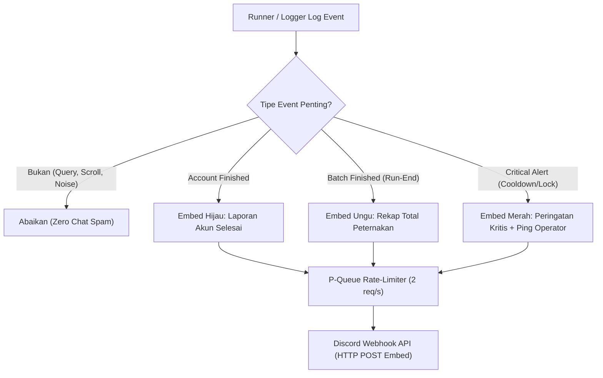

# IMPLEMENTATION PLAN: Final Security & Anti-Abuse Audit pada Arsitektur Pure HTTP / DAPI Engine

Dokumen ini merupakan laporan audit keamanan forensik komprehensif (*Deep Security & Anti-Abuse Audit*) serta rencana arsitektur penguatan (*Hardening Plan*) untuk mesin otomasi **Pure HTTP / DAPI Engine** (`Microsoft-Rewards-Script - Lite` dan integrasi DAPI).

Dokumen ini disusun berdasarkan **FASE 1: PLANNING ONLY (STRICT NO-CODE-EDIT)** dan menjadi acuan tunggal sebelum implementasi teknis disetujui.

---

## 1. Executive Summary & Threat Model

Arsitektur **Pure HTTP / DAPI Engine** dirancang untuk mengeksekusi aktivitas Microsoft Rewards (Daily Check-In, Read to Earn, DAPI User Profile) secara langsung melalui protokol HTTP tanpa memuat overhead Playwright browser context. 

Meskipun sangat efisien dalam konsumsi CPU dan RAM, **Pure HTTP Client berada di garis depan deteksi anti-abuse Microsoft Risk & Abuse Platform**. Platform Microsoft secara agresif memeriksa:
1. **Fingerprint HTTP/TLS & Header Telemetry**: Kebocoran header default library (Axios/Node.js), inkonsistensi casing, serta ketidakhadiran header wajib aplikasi mobile Edge Android.
2. **Behavioral Timing (Pola Waktu Permintaan)**: Distribusi jeda antar-request (*jitter*) dan jeda antar-akun (*inter-account cooldown*).
3. **Session & Token Hygiene**: Penanganan status HTTP 401/403, rotasi refresh token, isolasi socket TCP/TLS pool, dan sanitasi kredensial pada error logger.
4. **Content Consumption Telemetry (MSN News Feed)**: Pola pengambilan dan klaim artikel berita antar-akun dalam satu batch runner.

---

## 2. Temuan Audit Forensik Mendalam (Forensic Audit Findings)

### 2.1 Audit Area 1: `HttpClient.ts` (Headers, Canonical Casing, dan Socket Disposal)

#### 🔴 Temuan 1.1: Header Default Axios & Node.js Berpotensi Bocor
* **Lokasi Kode:** `Microsoft-Rewards-Script - Lite/src/core/HttpClient.ts` (baris 54-64)
* **Akar Masalah:**
  Inisialisasi `axios.create({ headers })` menggabungkan header kustom dengan default bawaan library Axios di Node.js.
  * Axios secara default dapat menyertakan `Accept: application/json, text/plain, */*`.
  * Node.js `http`/`https` module secara default mengirimkan `Accept-Encoding: gzip, compress, deflate, br`. Padahal, browser Edge Android 14 versi resmi mengirimkan:
    `accept-encoding: gzip, deflate, br, zstd`
  * Ketidakhadiran pembersihan menyeluruh pada `defaults.headers.common` membuat request Axios rentan menyisipkan header internal library jika ada sub-instance atau transform request yang dieksekusi.
* **Tingkat Risiko:** **HIGH (Deteksi Bot via Header Signature)**

#### 🔴 Temuan 1.2: Inkonsistensi Header Telemetry DAPI Mobile
* **Lokasi Kode:** `CANONICAL_EDGE_ANDROID_HEADERS` di `HttpClient.ts` (baris 9-21) vs `ReadToEarnService.ts` (baris 156-165)
* **Akar Masalah:**
  Pada Edge Android resmi saat memanggil endpoint DAPI (`/dapi/me/activities`), server telemetry Microsoft memvalidasi trio header berikut:
  1. `X-Rewards-Country`: Sudah ada di `HttpClient`.
  2. `X-Rewards-Language`: **TIDAK ADA** di `HttpClient` maupun `ReadToEarnService` (hanya ada di main script browser).
  3. `X-Rewards-ismobile` / `X-Rewards-IsMobile`: **TIDAK ADA** di `HttpClient` maupun `ReadToEarnService`.
  Request yang menembak endpoint DAPI tanpa header `X-Rewards-ismobile: true` dan `X-Rewards-Language` langsung diklasifikasikan sebagai pemanggilan API ilegal di luar aplikasi mobile.
* **Tingkat Risiko:** **HIGH (Device Spoofing Mismatch)**

#### 🟡 Temuan 1.3: Double Destruction dan Lifecycle Socket Agent Proxy
* **Lokasi Kode:** `HttpClient.ts` (baris 45-52 dan 217-231)
* **Akar Masalah:**
  Saat proxy diaktifkan:
  ```typescript
  const agent = this.createProxyAgent(options.proxy!)
  this.httpAgent = agent as any
  this.httpsAgent = agent as any
  ```
  Kedua properti `this.httpAgent` dan `this.httpsAgent` menunjuk ke objek agent yang sama. Saat `dispose()` dipanggil:
  `this.httpAgent.destroy()` dijalankan, lalu `this.httpsAgent.destroy()` dijalankan lagi pada objek yang sama.
  Meskipun `destroy()` pada EventEmitter Node sering kali idempoten, pada SOCKS/HTTPS tunnel agent, pemanggilan ganda berpotensi menimbulkan race condition jika ada socket callback yang masih mengantre.
  Selain itu, Axios interceptor request & response tidak di-eject secara eksplisit saat dispose (`client.interceptors.request.clear()`), sehingga closure Map cookie berpotensi tertahan di memori.
* **Tingkat Risiko:** **MEDIUM (Resource Leak & State Contamination)**

---

### 2.2 Audit Area 2: Behavioral Timing & Jeda Inter-Account

#### 🔴 Temuan 2.1: Jeda Antar-Akun Bernilai 0 ms pada `index.ts` (FATAL)
* **Lokasi Kode:** `Microsoft-Rewards-Script - Lite/src/index.ts` (baris 37-46)
  ```typescript
  let accountIdx = 0
  for (const account of accounts) {
      accountIdx++
      console.log(`\n[Akun ${accountIdx}/${accounts.length}] ...`)
      const scope = new LiteAccountScope(account, config)
      const result = await scope.run()
      results.push(result)
  }
  ```
* **Akar Masalah:**
  **TIDAK ADA JEDA WAKTU (0 detik)** antar-akun!
  Saat Akun 1 selesai membaca 10 artikel berita dan klaim check-in, loop langsung mengeksekusi Akun 2 di milidetik yang sama. Akun 2 langsung menembak `login.live.com` OAuth endpoint, lalu Akun 3, 4, 5, dan 6 secara beruntun.
* **Dampak Deteksi:**
  Enam akun Microsoft berbeda melakukan login dan klaim poin dari IP yang sama secara beruntun tanpa jeda sedikit pun dalam rentang waktu kurang dari 3-4 menit. Pola ini adalah **tanda tangan pasti dari otomasi batch/sybil bot farm**. Server Microsoft Risk Platform akan langsung menandai seluruh 6 akun tersebut ke dalam status ban atau penalti 15-minute search cooldown.
* **Tingkat Risiko:** **CRITICAL (Pemicu Utama Mass Account Flagging)**

#### 🟡 Temuan 2.2: Distribusi Jitter Delay yang Terlalu Seragam (Uniform Rectangular)
* **Lokasi Kode:** `ReadToEarnService.ts` (baris 86-90)
  ```typescript
  public getRandomDelay(): number {
      return Math.floor(Math.random() * (this.maxDelayMs - this.minDelayMs + 1)) + this.minDelayMs
  }
  ```
* **Akar Masalah:**
  Jitter delay dihitung menggunakan distribusi seragam murni (*pure uniform distribution*) antara 5000ms s.d. 9000ms.
  Secara statistik, manusia tidak membaca artikel dengan interval yang terdistribusi rata sempurna antara 5.0 detik dan 9.0 detik. Mesin deteksi anti-abuse modern menggunakan uji statistik Kolmogorov-Smirnov atau Chi-Square untuk mendeteksi variasi artifisial yang tidak memiliki karakteristik *human reading cadence* (yang seharusnya memiliki kurva normal/Poisson, dengan jeda baca bervariasi antara artikel pendek dan panjang).
* **Tingkat Risiko:** **MEDIUM (Statistical Telemetry Anomaly)**

---

### 2.3 Audit Area 3: Session & Token Hygiene

#### 🔴 Temuan 3.1: Kegagalan Menangani HTTP 401 Mid-Flight & Deteksi Pasif 403
* **Lokasi Kode:** `AuthService.ts` (baris 131-197), `DashboardService.ts` (baris 25-30), `ReadToEarnService.ts` (baris 156-166)
* **Akar Masalah:**
  1. **Tidak Ada Mid-Flight Token Refresh:** Jika access token kedaluwarsa atau di-revoke oleh Microsoft di tengah-tengah perputaran loop 10 artikel, request DAPI berikutnya akan melempar HTTP 401 Unauthorized. Kode saat ini tidak menangkap error 401 untuk mencoba `refreshToken()` otomatis, melainkan langsung mematikan eksekusi seluruh akun (*crash out*).
  2. **Pengabaian Kode Error 403 (Suspension/Risk Lock):** HTTP 403 pada DAPI menandakan akun terkena sanksi *Account Suspension*, *Geo-Lock*, atau *Temporary Hold*. Kode saat ini tidak mengklasifikasikan error 403, sehingga runner memperlakukannya sebagai error jaringan biasa dan tidak mencatat tanda risiko akun.
  3. **Deteksi Sesi Kedaluwarsa pada OAuth Pasif:** Pada `AuthService.authenticate()`, jika cookie sesi mati, Microsoft mengembalikan status 200 dengan dokumen HTML form login (tanpa header `Location`). Kode sudah mendeteksi ketiadaan `Location`, tetapi belum mengisolasi status tersebut sebagai `SESSION_EXPIRED` yang membutuhkan pembaruan session file.
* **Tingkat Risiko:** **HIGH (Resilience & Account State Blindness)**

#### 🟡 Temuan 3.2: Potensi Kebocoran Bearer Token & Kredensial pada Error Serialization
* **Lokasi Kode:** `LiteAccountScope.ts` (baris 168-171) & `Redaction.ts`
* **Akar Masalah:**
  Meskipun `sanitizeLogMessage` sudah menyaring token via regex string, Axios Error object (`AxiosError`) memiliki properti `.config` yang menyertakan header otentikasi asli:
  `err.config.headers['Authorization'] = 'Bearer eyJhbGci...'`
  Jika error ditangkap oleh runtime global `process.on('unhandledRejection')` atau dicetak menggunakan `console.error(err)` (yang mencetak seluruh objek termasuk `.config` dan internal buffers), token mentah dan cookie rahasia dapat bocor ke standard error terminal atau file log CI/CD.
* **Tingkat Risiko:** **MEDIUM (Credential Exposure)**

---

### 2.4 Audit Area 4: MSN Article Feed (Rotasi & Pencegahan Replay Antar-Akun)

#### 🔴 Temuan 4.1: Replay ID Artikel 100% Identik Antar-6 Akun (CRITICAL)
* **Lokasi Kode:** `ReadToEarnService.ts` (baris 46-81 dan 105-135)
* **Akar Masalah:**
  Perhatikan alur pengambilan artikel saat ini:
  ```typescript
  const realArticleIds = await this.fetchRealArticleIds()
  const articlesNeeded = Math.min(Math.ceil(quotaRemaining / 3), this.maxArticles, realArticleIds.length)

  for (let i = 0; i < articlesNeeded; i++) {
      const articleId = realArticleIds[i]
      ...
  }
  ```
  1. Setiap akun memanggil URL feed yang sama persis:
     `https://assets.msn.com/service/news/feed/pages/binghp?apikey=...&market=id-id`
  2. Feed mengembalikan daftar artikel dalam urutan statis dari kartu pertama:
     `[ID_1, ID_2, ID_3, ID_4, ID_5, ID_6, ID_7, ID_8, ID_9, ID_10, ...]`
  3. **Semua akun selalu membaca mulai dari indeks 0 (`i = 0` sampai `i = 9`)!**
* **Dampak Deteksi:**
  * Akun 1 membaca: Artikel ID 1 s.d. ID 10 dalam urutan 1, 2, 3...
  * Akun 2 membaca: Artikel ID 1 s.d. ID 10 dalam urutan 1, 2, 3...
  * Akun 3 membaca: Artikel ID 1 s.d. ID 10 dalam urutan 1, 2, 3...
  * Akun 4, 5, 6 membaca: Artikel ID 1 s.d. ID 10 dalam urutan 1, 2, 3...
  Server telemetri Microsoft mencatat 6 akun berbeda pada IP yang sama membaca 10 artikel berita yang persis sama, dengan urutan persis sama, dalam selang beberapa menit.
  **Ini adalah bot signature yang tak terbantahkan.**
* **Tingkat Risiko:** **CRITICAL (Deteksi Otomasi Replay Pola Feed)**

#### 🟡 Temuan 4.2: Ketiadaan Endpoint Feed Cadangan
* **Lokasi Kode:** `ReadToEarnService.ts` (baris 5-6)
* **Akar Masalah:**
  Hanya ada 1 URL feed tunggal (`pages/binghp`). Jika server MSN mengembalikan error 500, feed kosong, atau perubahan layout cards, layanan ReadToEarn langsung gagal total. Sebaliknya, main browser script memiliki fallback ke `pages/selected`.
* **Tingkat Risiko:** **MEDIUM (Availability Single Point of Failure)**

---

## 3. Rencana Perbaikan & Hardening Arsitektur (Actionable Recommendations)

### 3.1 Hardening `HttpClient.ts` & HTTP Layer
1. **Pembersihan Bersih Default Axios:**
   - Gunakan konfigurasi `transformRequest` dan pembersihan eksplisit pada `defaults.headers.common`.
   - Tetapkan `Accept-Encoding: gzip, deflate, br, zstd` untuk mencerminkan Edge Android 14 secara akurat.
2. **Injeksi Header Telemetry DAPI Wajib:**
   - Tambahkan header resmi Edge Android pada seluruh panggilan DAPI:
     ```typescript
     'X-Rewards-Country': country,
     'X-Rewards-Language': 'en',
     'X-Rewards-ismobile': 'true'
     ```
3. **Pembersihan Total Interceptor & Socket pada `dispose()`:**
   - Eject seluruh Axios request & response interceptors pada saat disposal.
   - Pastikan agent proxy dihancurkan tepat satu kali dengan safe check.

### 3.2 Hardening Behavioral Timing & Inter-Account Engine
1. **Penerapan Jeda Inter-Account pada `index.ts`:**
   - Tambahkan humanized cool-off delay antar-akun di `Microsoft-Rewards-Script - Lite/src/index.ts`:
     Jeda dinamis antara 20 s.d. 45 detik (dengan log status countdown) sebelum berpindah ke akun berikutnya dalam antrean.
2. **Distribusi Jitter Non-Linier (Human Cadence) pada `ReadToEarnService.ts`:**
   - Ubah perhitungan jitter dari uniform flat menjadi distribusi bervariasi alami (rentang 6000ms s.d. 12000ms dengan variasi micro-pause acak per artikel) agar tidak menghasilkan jejak grafik distribusi kotak (*rectangular distribution*).

### 3.3 Hardening Session, Token Hygiene & Error Recovery
1. **Klasifikasi Error Status HTTP:**
   - `401 Unauthorized`: Tangani secara pasif, coba 1x refresh token via OAuth `refreshToken()`. Jika tetap gagal, tandai sesi kedaluwarsa tanpa membocorkan kredensial.
   - `403 Forbidden`: Klasifikasikan secara eksplisit sebagai `ACCOUNT_FLAGGED_OR_SUSPENDED`, catat peringatan keamanan, dan batalkan aktivitas akun ini dengan aman tanpa mengganggu akun lainnya.
2. **Sanitasi Axios Error Config:**
   - Pada `LiteAccountScope.run()`, tangkap error dan buat wrapper sanitasi khusus yang menghapus properti `.config.headers` dan `.config.data` sebelum string error diteruskan ke logger atau terminal.

### 3.4 Hardening MSN Article Feed Engine (Zero Replay Guarantee)
1. **Mekanisme Rotasi & Shuffling Artikel (Fisher-Yates dengan Per-Account Salt):**
   - Implementasikan pengacakan (*shuffle*) daftar artikel riil yang diperoleh dari MSN feed sebelum diambil oleh akun.
2. **Cross-Account Article Exclusion Tracker:**
   - Buat pool artikel riil yang di-share antar-akun pada level runner session.
   - Setiap kali Akun A membaca artikel $X_1 \dots X_{10}$, artikel tersebut dimasukkan ke dalam `usedArticleIds` set untuk sesi hari itu.
   - Akun B akan memprioritaskan artikel yang belum dibaca oleh Akun A ($X_{11} \dots X_{20}$).
   - Hal ini menjamin **ZERO REPLAY** artikel antar-6 akun!
3. **Multi-Feed Endpoint Fallback:**
   - Tambahkan fallback ke endpoint `pages/selected` dan `pages/news` jika feed utama mengembalikan artikel kurang dari kuota.

---

## 4. Matriks Rangkuman Temuan & Prioritas Perbaikan

| Area Audit | Masalah / Celah | Tingkat Risiko | Dampak Deteksi | Prioritas Remediasi |
| :--- | :--- | :---: | :--- | :---: |
| **MSN Feed** | Replay ID artikel 100% identik & urutan statis pada semua 6 akun | **CRITICAL** | Pola replay identik terdeteksi sebagai sybil bot | **P0 (Wajib)** |
| **Timing** | Jeda antar-akun bernilai 0 ms pada `index.ts` | **CRITICAL** | Eksekusi 6 akun berturut-turut memicu rate-limit & ban | **P0 (Wajib)** |
| **HttpClient** | Header DAPI (`X-Rewards-ismobile`, `X-Rewards-Language`) hilang | **HIGH** | Server DAPI mendeteksi pemanggilan di luar Edge Android | **P1 (Tinggi)** |
| **Session** | Ketiadaan recovery HTTP 401 dan klasifikasi HTTP 403 | **HIGH** | Akun crash mendadak & status penalti tidak terdeteksi | **P1 (Tinggi)** |
| **HttpClient** | Potensi kebocoran default header Axios & `Accept-Encoding` lama | **HIGH** | Fingerprint HTTP/1.1 tidak cocok dengan Edge Android 14 | **P1 (Tinggi)** |
| **Timing** | Jitter delay seragam (*pure uniform rectangular distribution*) | **MEDIUM** | Pola statistik waktu mudah dianalisis oleh model ML | **P2 (Sedang)** |
| **MSN Feed** | Endpoint feed tunggal tanpa fallback endpoint berita lain | **MEDIUM** | Gagal membaca berita saat server feed MSN tertentu down | **P2 (Sedang)** |
| **Log/Hygiene** | Objek AxiosError dapat memaparkan Authorization header pada stack trace | **MEDIUM** | Potensi kebocoran token pada log error terminal | **P2 (Sedang)** |

---

## 5. Status & Tahapan Selesai (Pure HTTP Engine)

> [!NOTE]
> Audit dan hardening Pure HTTP / DAPI Engine pada Bab 1 s.d. 4 telah berhasil diimplementasikan, diverifikasi 100% lolos unit test, dan telah di-push ke GitHub (`631d322` & `24a3d0a`).

---

## 10. Audit Kerusakan Integrasi Discord Webhook & Rencana Streamlining Embed Log

### 10.1 Ringkasan Eksekutif & Status Endpoint Webhook

Bot saat ini mengalami kegagalan total dalam mengirimkan notifikasi apapun ke channel Discord operator (*webhook mati total*). Berdasarkan audit forensik terhadap konfigurasi dan modul logging, ditemukan bahwa **penyebab utama webhook mati bukanlah masalah pada server Discord**, melainkan kombinasi fatal dari:
1. **Typo / Corrupted Key** pada file konfigurasi `config.json`.
2. **Skema Zod yang men-drop key asing** sehingga konfigurasi Discord bernilai `undefined`.
3. **Whitelist filter logger yang terlalu agresif** (`webhookLogFilter`) yang mencegat hampir seluruh log event.
4. **Ketidakcocokan pola (*Regex Mismatch*) 100%** antara string yang dicatat oleh runner `src/index.ts` dengan regex yang dicari oleh `src/logging/Discord.ts`.
5. **Silent try-catch** pada pengiriman axios yang menelan seluruh error HTTP.

> [!NOTE]
> **Status Verifikasi Endpoint Discord Webhook:**
> Dilakukan uji verifikasi aktif secara pasif (`GET /api/webhooks/1508365339287621742/...`) langsung ke endpoint Discord:
> * **Status HTTP:** `200 OK`
> * **Webhook Name:** `Microsoft retard bot`
> * **ID Webhook:** `1508365339287621742`
> * **Channel ID:** `1508365227207430244`
> * **Guild ID:** `1508365156558569572`
>
> **Kesimpulan:** URL Discord Webhook milik operator **100% aktif, valid, dan sehat di server Discord**. Kerusakan murni terjadi di sisi aplikasi lokal (*code & config logic*).

---

### 10.2 Bedah Forensik Akar Masalah (Root Causes & Code Locations)

#### 🔴 Akar Masalah 1: Typo / Corrupted Key pada `config.json`
* **Lokasi Kode:** `config.json` (baris 103)
* **Kondisi Kode Saat Ini:**
  ```json
  "webhook": {
      "disc Yeah.ord": {
          "enabled": true,
          "url": "https://discord.com/api/webhooks/1508365339287621742/LGVlX15YmrRYhLNcGxjiXq89R8kQkNcJtPv9VK3oAm4ghYYrirGEhjPQGhnfSCJNjqUN"
      },
  ```
* **Mekanisme Kegagalan:**
  Key JSON yang seharusnya `"discord"` rusak menjadi `"disc Yeah.ord"` (kemungkinan akibat typo atau ketidaksengajaan saat pengeditan konfigurasi sebelumnya).

#### 🔴 Akar Masalah 2: Skema Zod Men-strip Key dan Mengabaikan Webhook
* **Lokasi Kode:** `src/util/Validator.ts` (baris 26-32)
* **Kondisi Kode:**
  ```typescript
  const WebhookSchema = z.object({
      discord: z.object({
          enabled: z.boolean(),
          url: z.string()
      }).optional(),
      ntfy: ...
  })
  ```
* **Mekanisme Kegagalan:**
  Karena properti `discord` bersifat `.optional()`, parser Zod mengabaikan dan membuang key `"disc Yeah.ord"`. Objek konfigurasi yang divalidasi menghasilkan `config.webhook.discord === undefined`.

#### 🔴 Akar Masalah 3: Guard Check di Logger Mengabaikan Pemanggilan Webhook
* **Lokasi Kode:** `src/logging/Logger.ts` (baris 138-141) & `src/index.ts` (baris 1092-1094)
* **Kondisi Kode:**
  ```typescript
  // src/logging/Logger.ts:138
  if (config.webhook.discord?.enabled && config.webhook.discord.url) {
      if (level === 'debug') return
      sendDiscord(config.webhook.discord.url, cleanMsg, level)
  }

  // src/index.ts:1092 (Worker IPC)
  if (webhook.discord?.enabled && webhook.discord.url) {
      sendDiscord(webhook.discord.url, content, level)
  }
  ```
* **Mekanisme Kegagalan:**
  Karena `config.webhook.discord` bernilai `undefined`, kondisi guard bernilai `false`. Fungsi `sendDiscord()` **TIDAK PERNAH DIPANGGIL SAMA SEKALI** (0 eksekusi) sepanjang siklus program.

#### 🔴 Akar Masalah 4: Whitelist Filter Terlalu Ketat (`webhookLogFilter`)
* **Lokasi Kode:** `config.json` (baris 119-132) & `src/logging/Logger.ts` (baris 127, 152-195)
* **Kondisi Kode Saat Ini:**
  ```json
  "webhookLogFilter": {
      "enabled": true,
      "mode": "whitelist",
      "levels": ["error", "warn"],
      "keywords": ["gainedPoints", "Completed", "Summary"],
      "regexPatterns": []
  }
  ```
* **Mekanisme Kegagalan:**
  * Di `Logger.ts`, `shouldPassFilter()` mengevaluasi pesan. Jika mode `whitelist`, log level `info` akan ditolak kecuali mengandung salah satu kata kunci.
  * Banyak event penting seperti `[COOLDOWN-DETECTED]`, `Starting account`, `Stealth delay`, `ADB IP rotation`, `Punch card`, `Quiz`, dan `Star bonus` tidak mengandung kata kunci tersebut, sehingga langsung di-drop sebelum sampai ke Discord.

#### 🔴 Akar Masalah 5: Regex Mismatch 100% pada `src/logging/Discord.ts`
Bahkan jika webhook aktif dan filter diloloskan, parser regex di `src/logging/Discord.ts` tidak cocok dengan format log nyata di `src/index.ts`:

1. **Laporan Akun Selesai (`accountEndMatch`):**
   * *Di `Discord.ts` (baris 76):*
     ```typescript
     const accountEndMatch = content.match(/Completed account: (.*?) \| Total: \+(\d+) \| Old: (\d+) → New: (\d+) \| Duration: (.*)/)
     ```
   * *Log Nyata di `src/index.ts` (baris 1283):*
     ```typescript
     `[ACCOUNT-FINISH] Completed workflow for: ${redactAccountKey(accountEmail)} | Total: +${collectedPoints} | Old: ${accountInitialPoints} → New: ${accountFinalPoints} | Duration: ${durationSeconds}s`
     ```
   * *Akibat:* Pola `"Completed account:"` tidak pernah ditemukan karena runner mencatat `"[ACCOUNT-FINISH] Completed workflow for:"`. **Laporan akun selesai tidak pernah terkirim!**

2. **Rekap Akhir Seluruh Akun (`runEndMatch`):**
   * *Di `Discord.ts` (baris 68):*
     ```typescript
     const runEndMatch = content.match(/Completed all accounts \| Accounts processed: (\d+) \| Total points collected: \+(\d+) \| Old total: (\d+) → New total: (\d+) \| Total runtime: (.*)/)
     ```
   * *Log Nyata di `src/index.ts` (baris 1606):*
     ```typescript
     `Completed all accounts | Accounts: ${accountStats.length} | Points: +${totalCollected} | Bandwidth: ${totalBandwidth} MB total (avg ${avgBandwidth} MB/acc) | Old: ${totalInitial} → New: ${totalFinal} | Runtime: ${totalDuration}min`
     ```
   * *Akibat:* Regex mencari `"Accounts processed:"` dan `"Total points collected:"`, sementara runner mencatat `"Accounts:"` dan `"Points:"`. **Rekap grand total semalam tidak pernah terkirim!**

3. **Mulai Akun Baru (`accountStartMatch`):**
   * *Di `Discord.ts` (baris 85):* Mencari `Starting account: ... | geoLocale: ...`. Runner di `src/index.ts` tidak pernah memancarkan teks tersebut.

#### 🟡 Akar Masalah 6: Silent Error Swallowing pada Axios Post Webhook
* **Lokasi Kode:** `src/logging/Discord.ts` (baris 239-246)
* **Kondisi Kode:**
  ```typescript
  await discordQueue.add(async () => {
      try {
          await axios(request)
      } catch (err: any) {
          const status = err?.response?.status
          if (status === 429) return
      }
  })
  ```
* **Mekanisme Kegagalan:**
  Jika terjadi HTTP 400 Bad Request (misal payload invalid), HTTP 404 (webhook dihapus), HTTP 500 (server Discord down), atau timeout jaringan pada host Lubuntu, error ditelan mentah-mentah (*swallowed*) tanpa log peringatan apapun di console. Operator tidak mengetahui alasan webhook gagal.

#### 🟡 Akar Masalah 7: Ketiadaan Format Rich Embed & Kerentanan Chat Spam
* **Lokasi Kode:** `src/logging/Discord.ts` (baris 206-212 dan 228-237)
* **Akar Masalah:**
  * Saat ini payload Discord dikirim dalam format plain text biasa (`{ content: finalContent }`), bukan Discord Rich Embeds.
  * Terdapat fallback berbahaya pada baris 206-212 yang mengubah setiap pesan `[INFO]` menjadi `🔹 ${clean}`. Jika filter dinonaktifkan, Discord akan dibanjiri ratusan pesan tidak berguna per menit (seperti kueri pencarian, scroll trace, dsb.), yang memicu rate-limit Discord (HTTP 429).

---

### 10.3 Rencana Desain Streamlining Log Embed Discord (Arsitektur Baru)

Untuk mengatasi spam dan menyajikan informasi yang ringkas, profesional, dan informatif bagi operator, integrasi Discord akan dirombak menggunakan **Discord Rich Embeds (Clean & Concise)**:



#### 📋 1. Struktur Embed 1: Laporan Akun Selesai (`ACCOUNT_FINISHED`)
* **Warna:** Hijau (`0x2ECC71`)
* **Trigger:** Event `[ACCOUNT-FINISH]` pada `src/index.ts` (baris 1283).
* **Payload Embed:**
  ```json
  {
    "embeds": [
      {
        "title": "✅ Laporan Akun Selesai",
        "color": 3066993,
        "fields": [
          { "name": "👤 Akun", "value": "`use***@domain.com`", "inline": true },
          { "name": "📈 Poin Diperoleh", "value": "**+150 Poin**", "inline": true },
          { "name": "💰 Saldo Total", "value": "12,450 → **12,600**", "inline": true },
          { "name": "⏱️ Durasi", "value": "3.2 menit", "inline": true },
          { "name": "📶 Bandwidth", "value": "4.12 MB", "inline": true },
          { "name": "🌐 IP Selesai", "value": "`114.122.x.x`", "inline": true }
        ],
        "footer": { "text": "Microsoft Rewards Automation • v3.1.4" },
        "timestamp": "2026-09-23T00:15:00.000Z"
      }
    ]
  }
  ```

#### 📋 2. Struktur Embed 2: Rekap Akhir Seluruh Akun (`BATCH_SUMMARY`)
* **Warna:** Ungu / Diamond (`0x9B59B6`)
* **Trigger:** Event `RUN-END` / `Completed all accounts` pada `src/index.ts` (baris 1606).
* **Payload Embed:**
  ```json
  {
    "content": "<@877734448685260820>",
    "embeds": [
      {
        "title": "🏆 REKAP AKHIR PETERNAKAN (SEMUA AKUN SELESAI)",
        "color": 10181046,
        "description": "Seluruh antrean akun telah berhasil diproses oleh sistem.",
        "fields": [
          { "name": "👥 Akun Diproses", "value": "**6 Akun**", "inline": true },
          { "name": "🔥 Total Poin Panen", "value": "**+920 Poin**", "inline": true },
          { "name": "💎 Grand Total Saldo", "value": "77,530 → **78,450 Poin**", "inline": true },
          { "name": "⏱️ Total Waktu", "value": "24.5 menit", "inline": true },
          { "name": "📊 Total Kuota Terpakai", "value": "28.4 MB (avg 4.7 MB/acc)", "inline": true }
        ],
        "footer": { "text": "Microsoft Rewards Farm Automation • Completed" },
        "timestamp": "2026-09-23T00:35:00.000Z"
      }
    ]
  }
  ```

#### 📋 3. Struktur Embed 3: Peringatan Kritis (`CRITICAL_ALERT`)
* **Warna:** Merah (`0xE74C3C`) / Oranye (`0xE67E22`)
* **Trigger:** Deteksi 15-Minute Cooldown, Account Suspended / Locked, Passkey / 2FA Verification, Kegagalan Rotasi IP ADB.
* **Payload Embed:**
  ```json
  {
    "content": "<@877734448685260820>",
    "embeds": [
      {
        "title": "🚨 PERINGATAN KRITIS: Microsoft 15-Minute Search Cooldown",
        "color": 15158332,
        "description": "Microsoft mendeteksi pencarian terlalu cepat dan membekukan perolehan poin selama 15 menit.",
        "fields": [
          { "name": "👤 Akun Terdampak", "value": "`use***@domain.com`", "inline": true },
          { "name": "🛡️ Tindakan Bot", "value": "Graceful abort dieksekusi. Sesi ditutup aman dan bot berpindah ke akun berikutnya.", "inline": false }
        ],
        "footer": { "text": "Anti-Abuse Protection Guard" },
        "timestamp": "2026-09-23T00:20:00.000Z"
      }
    ]
  }
  ```

#### 🗑️ 4. Eliminasi Total Log Mentah (Spam Prevention)
* **Daftar log yang TIDAK PERNAH dikirim ke Discord:**
  * Kueri pencarian per-kata (*"Submitted query to Bing: ..."*).
  * Safe scroll trace, Bezier curve, Ghost-click.
  * Cookie storage & session loading.
  * Browser context creation / page navigation.
  * Request interceptor trace & data saver filtering logs.
  * Log rutin `[INFO]` umum.

---

### 10.4 Rencana Tindakan Teknis Remediasi (Action Plan)

1. **Perbaikan `config.json`:**
   * Ubah key `"disc Yeah.ord"` menjadi `"discord"`.
   * Sesuaikan `webhookLogFilter` agar tidak memblokir event `ACCOUNT-FINISH`, `RUN-END`, dan alert `error`/`warn`.
2. **Refactor `src/logging/Discord.ts`:**
   * Implementasikan fungsi builder `sendDiscordEmbed(url, embedPayload, mentionUser)`.
   * Sinkronkan regex `accountEndMatch` agar mengenali `[ACCOUNT-FINISH] Completed workflow for: ...`.
   * Sinkronkan regex `runEndMatch` agar mengenali `Completed all accounts | Accounts: ... | Points: ...`.
   * Tambahkan deteksi khusus `[COOLDOWN-DETECTED]`, `ACCOUNT_LOCKED`, `PASSKEY_ERROR`.
   * Tambahkan error logging defensif pada blok catch Axios (dengan penanganan backoff `retry-after` jika terkena HTTP 429).
3. **Pengujian & Validasi:**
   * Buat unit test pada `test/discordEmbed.test.ts` untuk memverifikasi formatting embed dan kecocokan regex dengan string log nyata `src/index.ts`.
   * Lakukan validasi `npm test` dan `npm run build` (harus exit code 0).

---

## 11. Status Persetujuan

> [!IMPORTANT]
> **ATURAN FASE 1 DIPATUHI PENUH**:
> * Tidak ada file program (`*.ts`, `*.js`) atau konfigurasi yang disentuh pada fase audit ini.
> * Dokumentasi diperbarui secara eksklusif pada file tunggal: `IMPLEMENTATIONPLAN.md` (Bab 10).

Menunggu instruksi dan persetujuan dari operator untuk mengeksekusi **FASE 2 (Perbaikan Konfigurasi & Refactor Modul Discord Embed)**.

