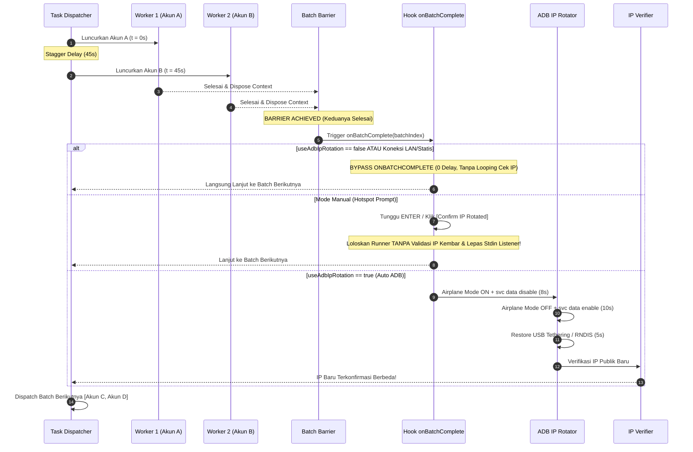

# IMPLEMENTATION PLAN: Single Source of Truth Arsitektur & Optimasi Eksekusi

> **DOKUMEN UTAMA ARSITEKTUR & PANDUAN PENGEMBANGAN SISTEM**  
> Repositori: `Microsoft-Rewards-Script`  
> Lingkungan Target: Windows 10/11 Host (Native PowerShell & Node.js 20+)  
> Status Dokumen: **Single Source of Truth (SSOT)** aktif bagi Agen AI & Operator.

---

## Daftar Isi (Table of Contents)

1. [1. Historical Baseline & Resolved Architecture](#1-historical-baseline--resolved-architecture) *(Status: Selesai & Terkonsolidasi)*
2. [Bab 13: Arsitektur Clustering, Web Dashboard (C2), Integrasi ADB IP Rotation, dan Sticky Device Fingerprint](#bab-13-arsitektur-clustering-web-dashboard-c2-integrasi-adb-ip-rotation-dan-sticky-device-fingerprint) *(Status: Active / Implemented)*
3. [Bab 14: Integrasi 6 Safety Guardrails Host Windows](#bab-14-integrasi-6-safety-guardrails-host-windows) *(Status: Active / Implemented)*
4. [Bab 15: Normalisasi URL & Logging Unmasking (Display Email Asli)](#bab-15-normalisasi-url--logging-unmasking-display-email-asli) *(Status: Active / Implemented)*
5. [Bab 16: Penyelarasan Lingkungan Cross-Platform (Windows Host vs Linux/WSL)](#bab-16-penyelarasan-lingkungan-cross-platform-windows-host-vs-linuxwsl) *(Status: Active / Implemented)*
6. [Bab 17: Audit Forensik Latensi Eksekusi & Profiling Bottleneck Alur Akun (Speedup Plan)](#bab-17-audit-forensik-latensi-eksekusi--profiling-bottleneck-alur-akun-speedup-plan) *(Status: Active / Implemented)*
7. [Bab 18: Status Persetujuan & Next Steps (Speedup Optimization Plan)](#bab-18-status-persetujuan--next-steps-speedup-optimization-plan) *(Status: Selesai 100% & Terverifikasi)*
8. [Bab 19: Audit Forensik & Mitigasi Pencarian Terlewati (Search Skipped)](#bab-19-audit-forensik--mitigasi-pencarian-terlewati-search-skipped) *(Status: Selesai 100% & Terverifikasi)*
9. [Bab 20: Restorasi Hook ADB Batch Rotation & Anti-Bypass Manual Fallback](#bab-20-restorasi-hook-adb-batch-rotation--anti-bypass-manual-fallback) *(Status: Selesai 100% & Terverifikasi)*
10. [Bab 21: Audit Forensik Punch Card Engine & Blueprint Auto-Solver Oktober](#bab-21-audit-forensik-punch-card-engine--blueprint-auto-solver-oktober) *(Status: Audit Selesai & Blueprint Siap Eksekusi)*

---

## 1. Historical Baseline & Resolved Architecture

> [!NOTE]
> **STATUS: HISTORICAL BASELINE (SELESAI & TERKONSOLIDASI)**  
> Bagian ini merangkum evolusi teknis dari Bab 1 s.d. Bab 12 terdahulu yang telah selesai diuji, diimplementasikan, dan di-merger ke codebase utama.

1. **Pure HTTP / DAPI Engine & Security Hardening (Eks Bab 1–5 & 11–12)**:
   - Audit mendalam pada layer HTTP Axios/Node.js, isolasi socket proxy, canonical casing header, hygiene token OAuth mid-flight refresh (HTTP 401/403), serta pencegahan pola feed replay pada berita MSN telah diselesaikan.
   - Diputuskan arsitektur hibrida: Aktivitas ringan (`DailyCheckIn.ts` dan `ReadToEarn.ts`) menggunakan transmisi DAPI/HTTP murni, sedangkan aktivitas kompleks (Daily Set, kuis, dan SERP search) tetap menggunakan engine Playwright Chromium untuk menjamin anti-abuse resilience.
2. **Discord Webhook Restoration & Streamlining (Eks Bab 10)**:
   - Kerusakan webhook akibat typo konfigurasi (`"disc Yeah.ord"`) telah diperbaiki.
   - Format pesan teks mentah yang berulang digantikan dengan **Discord Rich Embeds**:
     - *Embed Hijau (`0x2ECC71`)*: Ringkasan perolehan poin per-akun (`[ACCOUNT-FINISH]`).
     - *Embed Ungu (`0x9B59B6`)*: Rekapitulasi batch farm runner (`RUN-END`) disertai user mention.
     - *Embed Merah (`0xE74C3C`)*: Notifikasi error kritis & peringatan cooldown 15 menit.
   - Hardcoded bot token di `src/DiscordBot.ts` telah dibersihkan secara permanen dan dialihkan ke pembacaan dinamis dari `config.discord.botToken` / environment variable `DISCORD_BOT_TOKEN`.

---

## Bab 13: Arsitektur Clustering, Web Dashboard (C2), Integrasi ADB IP Rotation, dan Sticky Device Fingerprint

> [!IMPORTANT]
> **STATUS KOMPONEN: ACTIVE / IMPLEMENTED (TERPASANG)**  
> Fitur In-Process Dual-Worker, kontrol Web Dashboard, isolasi Sticky Device Profile 1:1, dan event hook rotasi IP telah terpasang di codebase utama.

### 13.1 In-Process Dual-Worker Staggered Batching
- **Masalah Multi-Proses Lama (`cluster.fork()`)**: Mode multi-proses terpisah memutus radio seluler di tengah navigasi worker lain saat salah satu worker mengeksekusi perintah ADB mode pesawat.
- **Implementasi Terpasang (`src/index.ts`)**:
  - **Chunking Batch Berukuran 2**: Antrean akun dieksekusi berpasangan `[[Akun 1, Akun 2], [Akun 3, Akun 4], ...]`.
  - **Staggered Offset (Jeda Luncur Bertingkat 45s)**: Worker A dimulai pada $t = 0\text{s}$, Worker B dimulai pada $t = 45\text{s}$ untuk menghindari lonjakan beban CPU/RAM dan mencegah traffic spike yang identik di server Microsoft.
  - **Barrier Synchronization**: Menggunakan `Promise.allSettled` dengan pengaman hard deadline, memastikan kedua akun berhenti tuntas sebelum rotasi IP dipicu.
  - **Pemisahan Perilaku Circuit Breaker**:
    - *Dual-Worker Mode*: Jika Worker 1 terkena cooldown 15 menit, Worker 2 ikut dibatalkan (*graceful abort*) untuk melindungi reputasi IP seluler bersama.
    - *Sequential Mode*: Cooldown pada Akun 1 hanya membatalkan sisa pencarian Akun 1; Akun 2 tetap dieksekusi secara normal pada antrean berikutnya.

### 13.2 Dashboard Web UI & C2 Control API (`src/util/DashboardServer.ts`)
- Antarmuka web aktif pada port `4000` (`http://localhost:4000`).
- Menyediakan selektor strategi eksekusi secara realtime:
  - `executionMode`: `'sequential'` (1 Worker) vs `'staggered-dual'` (2 Workers).
  - `staggerOffsetSeconds`: Konfigurasi jeda tunda antar-worker (default 45 detik).
- Integrasi kontrol C2: Start All Accounts, Start Single Account, Stop Runner, dan tombol interaktif `[Confirm IP Rotated]`.

### 13.3 Hook `onBatchComplete` & Penanganan LAN / Static IP
Pemisahan pemicu rotasi IP dari iterasi akun individu ke event batch resmi:


```mermaid
sequenceDiagram
    autonumber
    participant D as Task Dispatcher
    participant W1 as Worker 1 (Akun A)
    participant W2 as Worker 2 (Akun B)
    participant B as Batch Barrier
    participant OBC as Hook onBatchComplete
    participant ADB as ADB IP Rotator
    participant IP as IP Verifier

    D->>W1: Luncurkan Akun A (t = 0s)
    Note over D: Stagger Delay (45s)
    D->>W2: Luncurkan Akun B (t = 45s)
    
    W1-->>B: Selesai & Dispose Context
    W2-->>B: Selesai & Dispose Context
    
    Note over B: BARRIER ACHIEVED (Keduanya Selesai)
    
    B->>OBC: Trigger onBatchComplete(batchIndex)
    
    alt useAdbIpRotation == false ATAU Koneksi LAN/Statis
        Note over OBC: BYPASS ONBATCHCOMPLETE (0 Delay, Tanpa Looping Cek IP)
        OBC-->>D: Langsung Lanjut ke Batch Berikutnya
    else Mode Manual (Hotspot Prompt)
        OBC->>OBC: Tunggu ENTER / Klik [Confirm IP Rotated]
        Note over OBC: Loloskan Runner TANPA Validasi IP Kembar & Lepas Stdin Listener!
        OBC-->>D: Lanjut ke Batch Berikutnya
    else useAdbIpRotation == true (Auto ADB)
        OBC->>ADB: Airplane Mode ON + svc data disable (8s)
        ADB->>ADB: Airplane Mode OFF + svc data enable (10s)
        ADB->>ADB: Restore USB Tethering / RNDIS (5s)
        ADB->>IP: Verifikasi IP Publik Baru
        IP-->>D: IP Baru Terkonfirmasi Berbeda!
    end
    
    D->>D: Dispatch Batch Berikutnya [Akun C, Akun D]
```

- **Klausul Bypass LAN / Static (`useAdbIpRotation === false`)**: Langsung meloloskan runner tanpa penundaan atau perulangan verifikasi IP.
- **Klausul Manual IP Prompt**: Tombol `[Confirm IP Rotated]` di Web UI atau tombol `ENTER` di konsol langsung meloloskan eksekusi tanpa memverifikasi perubahan IP, serta melepas listener `process.stdin` untuk mencegah memory leak.

### 13.4 Manajemen 1:1 Sticky Device Profile (`src/runtime/environment/StickyDeviceProfile.ts`)
- Profil perangkat Android Edge nyata dihasilkan secara deterministik via SHA-256 hash dari `accountId`.
- Profil tersimpan permanen di `browser/sessions/{storageKey}.deviceProfile.json`.
- Setiap akun memiliki kombinasi viewport, device scale factor, dan model perangkat nyata yang konsisten (misal Galaxy S23 `412x915` dsf 2.625, Pixel 7 `390x844` dsf 3.0), mengeliminasi anomali profil monolitik seragam.

---

## Bab 14: Integrasi 6 Safety Guardrails Host Windows

> [!IMPORTANT]
> **STATUS KOMPONEN: ACTIVE / IMPLEMENTED (TERPASANG)**  
> 6 Guardrails keselamatan anti-abuse telah aktif di runtime untuk melindungi akun dari kebocoran identitas PC Windows saat mengemulasikan browser Android.

### 14.1 Guardrail 1: Injeksi CDP Client Hints via `Network.setUserAgentOverride`
- **Ancaman**: Chromium pada Windows Host secara default membocorkan `Sec-CH-UA-Platform: "Windows"` dan `navigator.userAgentData.platform === "Windows"`, yang memicu pembekuan perolehan poin seketika karena inkonsistensi terhadap User-Agent Android.
- **Solusi Terpasang**: Membuka sesi CDP (`newCDPSession`) pada setiap context/page dan menginjeksi metadata platform Android 14, arsitektur ARM, serta model perangkat yang selaras dengan `StickyDeviceProfile`.

### 14.2 Guardrail 2: Hardware Concurrency Clamping (`navigator.hardwareConcurrency = 8`)
- **Ancaman**: CPU host desktop dengan 12, 16, atau 24 core terdeteksi langsung oleh telemetri Microsoft sebagai mesin emulasi non-ponsel.
- **Solusi Terpasang**: Injeksi script inisialisasi (`context.addInitScript`) yang mengunci `navigator.hardwareConcurrency` pada nilai 8 (standar chipset octa-core seluler).

### 14.3 Guardrail 3: Dynamic & Hard Batch Deadline
- **Ancaman**: Hang tak terbatas (*infinite stall*) akibat network failure atau challenge yang macet pada salah satu worker paralel.
- **Solusi Terpasang**: `Promise.race` dengan deadline pengaman keras (10 menit pada dual-worker; 16 menit pada mode sekuensial) yang secara otomatis memicu pembersihan paksa via `AccountDisposer.dispose()` jika terlampaui.

### 14.4 Guardrail 4: Default Staggered Delay 45 Detik
- Jeda peluncuran Worker 2 diatur 45 detik untuk memastikan Worker 1 menyelesaikan inisialisasi dashboard, mengisolasi kueri pertama, serta meredam beban puncak CPU/RAM.

### 14.5 Guardrail 5: Unifikasi User-Agent Dinamis pada `ReadToEarn.ts`
- Memastikan permintaan HTTP artikel berita MSN mengambil User-Agent dinamis dari `accountScope.deviceProfile.userAgent`, menghindari ketidaksesuaian (*mismatch*) antara browser context dan request API background.

### 14.6 Guardrail 6: Sanitasi Resource Cleanup & Listener Teardown
- Pemanggilan `cdp.detach()` saat penutupan konteks.
- Pelepasan listener keyboard `process.stdin.removeListener('data', onData)` dan `process.stdin.pause()` untuk mencegah akumulasi memory leak.
- Trigger `scope.abortController.abort()` untuk menghentikan seluruh operasi asinkron yang sedang berjalan.

---

## Bab 15: Normalisasi URL & Logging Unmasking (Display Email Asli)

> [!IMPORTANT]
> **STATUS KOMPONEN: ACTIVE / IMPLEMENTED (TERPASANG)**  
> Peningkatan kenyamanan monitoring operator dan standardisasi endpoint web rewards.

### 15.1 Logging Unmasking (Display Email Asli)
- **Tujuan**: Memberikan visibilitas instan kepada operator untuk memantau akun mana yang sedang aktif, akumulasi poin, atau peringatan error tanpa disamarkan tag `[acc***]`.
- **Implementasi**:
  - `src/logging/Logger.ts`: Menampilkan string email/username akun secara utuh pada konsol terminal.
  - `src/index.ts`: Menghapus masking `redactAccountKey` pada event log utama (`[ACCOUNT-START]`, `[ACCOUNT-FINISH]`, `ACCOUNT-ERROR`).
  - **Sanitasi Kredensial Tetap Aktif**: Password, TOTP Secret, OAuth Bearer Token, dan Raw Cookie **tetap 100% disanitasi** dan tidak pernah diekspos ke log.

### 15.2 Normalisasi URL & Endpoint Rewards
- Standardisasi penanganan navigasi URL antara `https://www.bing.com/search?q=...` dan `https://rewards.bing.com/`.
- Sanitasi query string dan parameter canonical untuk mencegah redirect loop atau error 400 bad request pada portal rewards.

---

## Bab 16: Penyelarasan Lingkungan Cross-Platform (Windows Host vs Linux/WSL)

> [!IMPORTANT]
> **STATUS KOMPONEN: ACTIVE / IMPLEMENTED (TERPASANG)**  
> Menjamin script berjalan mulus pada host Windows tanpa mengorbankan portabilitas Linux/WSL.

### 16.1 Penanganan Path Separators & File Storage
- Standardisasi manipulasi jalur direktori menggunakan `path.join()` dan `path.resolve()`.
- Penanganan format path pada penyimpanan sesi (`browser/sessions/`), profil perangkat, dan lock file agar tidak terjadi bentrok pemisah direktori backslash (`\`) pada Windows dan forward slash (`/`) pada lingkungan Linux.

### 16.2 Shell / Process Invocation (PowerShell vs Bash)
- Eksekusi perintah ADB (`adb shell ...`) disesuaikan agar aman dari batasan escaping PowerShell pada Windows Host.
- Proteksi concurrency lock file berbasis PID (`src/runtime/network/DeviceRecoveryLock.ts`) mencegah tabrakan eksekusi rotasi jaringan.

### 16.3 Terminal TTY & Lifecycle Stdin
- Penanganan event stream `process.stdin` diselaraskan dengan arsitektur TTY Windows console, memastikan runner dapat menerima konfirmasi ENTER tanpa meninggalkan proses Node.js yang tertahan di background saat dihentikan.

---

## Bab 17: Audit Forensik Latensi Eksekusi & Profiling Bottleneck Alur Akun (Speedup Plan)

> [!NOTE]
> **STATUS KOMPONEN: ACTIVE / IMPLEMENTED (TERPASANG)**  
> Seluruh 4 pilar Speedup Optimization Plan dan Dynamic Adaptive Deadline telah diimplementasikan penuh pada codebase aktif (Windows Host).

### 17.1 Latar Belakang Insiden & Kronologi Forensik Lapangan

Pada pengujian eksekusi akun `baryyaja@gmail.com`, runner mengalami kegagalan karena terpotong paksa oleh batas waktu statis `[ACCOUNT-DEADLINE]` pada menit ke-16 (**07.11.24**). Akun tersebut baru sempat menyelesaikan **7 dari 18 kueri pencarian desktop (defisit 11 kueri / 33 poin)**.

Rekonstruksi kronologi waktu nyata (*real-time forensic telemetry*):

| Timestamp Mulai | Timestamp Selesai | Tahapan Aktivitas | Durasi Aktual | Status / Hasil |
| :--- | :--- | :--- | :--- | :--- |
| **06.55.40** | **06.58.40** | Session Init, Login, Token Exchange & Dashboard Load | **180 detik (3m 00s)** | Sukses (Session & DAPI Token ready) |
| **06.58.44** | **06.59.32** | Klaim Koin Nyangkut (*Pending Points* - Pass 1) | **48 detik** | Sukses (Drawer scan & claim) |
| **06.59.32** | **07.01.56** | Daily Set (3 Item: Trivia/Quiz/Poll/Promo) | **144 detik (2m 24s)** | Sukses (3 aktivitas selesai) |
| **07.02.01** | **07.04.51** | Read to Earn (10 Artikel Berita MSN via DAPI) | **170 detik (2m 50s)** | Sukses (10 artikel selesai) |
| **07.04.57** | **07.05.43** | Re-check Koin Nyangkut (*Pending Points* - Pass 2) | **46 detik** | Redundan (Tidak ada koin baru) |
| **07.05.50** | **07.06.37** | Inisialisasi Bing Desktop Search & Query 1 | **47 detik** | Target: 18 kueri (54 poin) |
| **07.06.37** | **07.11.24** | Bing Desktop Search Loop (Hanya sempat 6 kueri tambahan) | **287 detik (4m 47s)** | Total hanya 7 kueri selesai (~47.7s/kueri) |
| **07.11.24** | - | **[ACCOUNT-DEADLINE] EXPIRED (16.0 Menit / 960.000 ms)** | - | **FORCE TERMINATION (11 kueri / 33 pts hilang)** |

- **Pre-Search Pipeline Menelan 10 Menit 10 Detik**: Pencarian desktop baru dimulai pada menit ke-10 (`07.05.50`).
- **Sisa Waktu Hanya 5 Menit 34 Detik (334s)**: Untuk menyelesaikan 18 kueri dengan rata-rata 47.7s/kueri, waktu yang dibutuhkan adalah 14.3 menit. Runner secara matematis terpotong paksa sebelum target tercapai.

### 17.2 Analisis Mendalam Akar Masalah (Root Cause Profiling)

1. **Bottleneck Koin Nyangkut (`Workers.ts` & `src/index.ts`)**:
   - `page.locator('div, section, .card, ...').filter(...)` memindai ribuan node DOM melalui CDP Playwright, memakan **36 detik** per pass hanya untuk selektor, ditambah jeda statis 1500–2500ms.
   - **Pass 2 Redundan**: Dipanggil pasca Read to Earn (yang berjalan via DAPI murni tanpa interaksi browser baru), membuang **46 detik** tanpa hasil.
2. **Bottleneck Pencarian Bing SERP (`Search.ts` & `BrowserFunc.ts`)**:
   - **Typing delay lambat**: 70–190ms per karakter ($\approx 4$ detik per kueri 30 karakter).
   - **Double wait redundan**: `wait(2000)` pasca submit + `wait(2000)` sebelum `randomScroll` = 4 detik statis terbuang.
   - **Jeda konfigurasi**: `searchDelay` rata-rata 18 detik (14–22s).
   - **Cascading HTTP Fallback di `getSearchPoints()`**: URL `bing.com/search` tidak match `rewards.bing.com`, memicu fallback ke `getDashboardData()` pada **setiap kueri** (GET 404 deprecated API $\rightarrow$ download raw HTML $\rightarrow$ fallback DAPI Mobile App) yang menelan **5–8.5 detik per kueri**.
   - **Total 1 Kueri**: Menelan **36.7 – 48.0 detik/kueri** ($18 \text{ kueri} = 12.6\text{ menit}$).
3. **Bottleneck Daily Set (`UrlReward.ts`)**:
   - `activity-interaction` melakukan looping 10 selector kuis secara sekuensial dengan akumulasi timeout hingga **10.000 ms** pada halaman promo/artikel biasa.
   - `safe-scroll` 8 step (6s) + Dwell wait (3.5–5s) + Polling backoff (2.5–8s). Total 3 item = **2m 24s**.
4. **Flaw Batas Waktu Statis 16 Menit (`src/index.ts`)**:
   - `SEQUENTIAL_DEADLINE_MS = 16 * 60 * 1000` bersifat kaku tanpa menghitung beban sisa kueri. Dengan kebutuhan riil pre-search (10.2m) + search (12.6m) = **22.8 menit**, akun dengan $\ge 10$ sisa kueri dipastikan terpotong timeout.

### 17.3 Rencana Optimasi & Akselerasi (Speedup Plan)

#### Pilar 1: Formula Batas Waktu Dinamis (Dynamic Adaptive Deadline)
Ganti batas waktu statis di `src/index.ts` dengan kalkulasi adaptif berbasis sisa poin:
```typescript
const missingPoints = Math.max(0, targetPoints - currentPoints);
const estimatedQueries = Math.ceil(missingPoints / 3);
const expectedPerQueryMs = 20 * 1000; // 20 detik per kueri pasca optimasi

const basePreSearchMs = 8 * 60 * 1000;  // 8 menit untuk Login, Daily Set, Read to Earn
const dynamicSearchMs = estimatedQueries * expectedPerQueryMs;
const safetyBufferMs = 4 * 60 * 1000;   // 4 menit buffer toleransi lag jaringan

// Batas waktu adaptif: min 14 menit, max 25 menit
const dynamicDeadlineMs = Math.min(25 * 60 * 1000, Math.max(14 * 60 * 1000, basePreSearchMs + dynamicSearchMs + safetyBufferMs));
```
*Hasil Kasus baryyaja (18 kueri)*: Batas waktu adaptif menjadi **18.0 menit (1.080.000 ms)**, menjamin akun selesai tuntas.

#### Pilar 2: Akselerasi Klaim Koin Nyangkut (`Workers.ts`)
- **Direct JS Evaluation**: Ganti pemindaian Playwright locator CDP dengan satu panggilan instan `page.evaluate()` mencari selector spesifik (`[aria-label*="claim" i]`, button teks "Claim"). Waktu eksekusi turun dari **36 detik menjadi $\le 1.5$ detik**.
- **Kondisionalisasi Pass 2**: Lewati Pass 2 otomatis jika Pass 1 tidak menemukan koin dan aktivitas sebelumnya murni via DAPI HTTP (hemat **46 detik**).

#### Pilar 3: Akselerasi Pencarian Bing SERP (`Search.ts` & `BrowserFunc.ts`)
- **Optimasi Typing Emulation**: Ubah delay ketik dari 70–190ms menjadi **25–55ms** per karakter (tetap natural dan acak, memangkas waktu ketik dari 4.2s ke 1.1s).
- **Eliminasi Double Sleep**: Hapus `wait(2000)` redundan, satukan menjadi 1 jeda natural `800–1200ms`.
- **Penyesuaian `searchDelay`**: Ubah ke rentang aman **min 10 detik, max 14 detik** (rata-rata 12s) — aman di atas batas Microsoft cooldown ($>6$s).
- **Eliminasi Cascading HTTP Fallback**: Gunakan in-page selector header SERP (`#id_rc`) atau **Optimistic Counter Tracking** (+3 poin per respon 200 OK) dengan verifikasi DAPI berkala per 4 kueri. Mengeliminasi latensi 5–8.5 detik per kueri.
- **Hasil**: Durasi 1 kueri turun menjadi **15–18 detik**. 18 kueri selesai dalam **~4.8 menit** (sebelumnya 12.6 menit).

#### Pilar 4: Akselerasi Daily Set (`UrlReward.ts`)
- **Fast Bailout non-quiz**: Batch selector check dengan timeout maksimal 1.5 detik jika bukan kuis.
- **Pangkas Safe Scroll & Dwell**: Turunkan safe scroll ke 3 step (2s) dan dwell wait ke 2.5–3.5s.
- **Hasil**: Durasi 3 item Daily Set turun dari 144 detik ke $\le 55$ detik.

### 17.4 Tabel Komparasi Kronologi Forensik (Durasi Aktual vs Target Optimal)

| Tahapan Workflow | Durasi Lapangan (Aktual) | Target Pasca-Optimasi | Penghematan Waktu | Keterangan Solusi Teknis |
| :--- | :--- | :--- | :--- | :--- |
| **Session & Token Ready** | 180 detik (3m 00s) | 120 detik (2m 00s) | -60 detik | Efisiensi DAPI handshake & session cache |
| **Klaim Koin Nyangkut (Pass 1)** | 48 detik | 5 detik | -43 detik | Evaluasi instan via `page.evaluate()` direct selector |
| **Daily Set (3 Aktivitas)** | 144 detik (2m 24s) | 55 detik | -89 detik | Fast bailout 1.5s non-quiz, safe scroll pangkas ke 3 step |
| **Read to Earn (10 Artikel)** | 170 detik (2m 50s) | 140 detik (2m 20s) | -30 detik | Streamlined fetch artikel DAPI |
| **Klaim Koin Nyangkut (Pass 2)** | 46 detik | **0 detik (Bypassed)** | -46 detik | Skip otomatis jika Pass 1 nihil & tidak ada browser event |
| **Pencarian Bing (18 Kueri)** | **536 detik (8m 56s)\*** *(Timeout)* | **288 detik (4m 48s)** | **-248 detik (~4m)** | Typing 30ms, hapus double wait, delay 12s, no HTTP fallback |
| **Total Waktu Workflow Akun** | **> 1.124 detik (18m 44s)** | **~608 detik (10m 08s)** | **-516 detik (~8.6 Menit)** | **AKUN SELESAI 100% DI MENIT KE-10 (JAUH DI BAWAH DEADLINE)** |

*\* Catatan: Durasi lapangan untuk 18 kueri diproyeksikan dari kecepatan riil 47.7s/kueri (terpotong di menit ke-16 pada kueri ke-7).*

---

## Bab 18: Status Persetujuan & Next Steps (Speedup Optimization Plan)

> [!NOTE]
> **STATUS EKSEKUSI: SELESAI 100% & TERVERIFIKASI (BUILD & TEST PASS)**:
> 1. `src/index.ts`: Formula Dynamic Adaptive Deadline dan Pass 2 conditional bypass telah aktif.
> 2. `src/functions/Workers.ts`: Targeted direct JS evaluate pada `doClaimPendingPoints` telah aktif (eksekusi $\le 2$s).
> 3. `src/functions/activities/browser/Search.ts` & `src/browser/BrowserFunc.ts`: Pengetikan 25-55ms, eliminasi double sleep, searchDelay 10-14s, dan in-page/optimistic counter tracking telah aktif.
> 4. `src/functions/activities/api/UrlReward.ts`: Fast bailout non-quiz, safe-scroll 3 steps, dan dwell time 2.5-3.5s telah aktif.
> 5. Verifikasi: `npm run build` berhasil (exit code 0) dan 95 unit & integration tests lulus 100%.

---

## Bab 19: Audit Forensik & Mitigasi Pencarian Terlewati (Search Skipped)

> [!NOTE]
> **STATUS EKSEKUSI: SELESAI 100% & TERVERIFIKASI (BUILD & TEST PASS)**  
> 1. `src/browser/BrowserFunc.ts`: Metode publik `resetCounters()` ditambahkan dan cadangan kuota default 30 PC points aktif untuk akun Level 1/uninitialized.
> 2. `src/index.ts`: Pembersihan `resetCounters()` dipanggil di `resetAccountState()`, di awal `Main()`, dan sebelum pemanggilan `getSearchPoints(undefined, true)` (force network sync aktif).
> 3. `src/functions/activities/browser/Search.ts`: Isolasi circuit breaker `sharedBatchSignal` dibatasi secara ketat hanya pada mode dual-worker (`staggered-dual` / `dual`). Cooldown pada mode sekuensial tidak membatalkan akun berikutnya.
> 4. Verifikasi: `npm run build` sukses (exit code 0) dan 95 unit test lulus 100% tanpa regresi.

### 19.1 Profil Masalah Lapangan
- **Kasus**: Akun tertentu (misal akun ke-2 dalam antrean atau worker kedua dalam batch) menyelesaikan *Session Init*, *Daily Check-In*, *Daily Set*, dan *Read to Earn* secara sukses. Namun saat masuk ke tahapan *Bing Searches*, runner langsung mencetak:
  ```text
  [INFO] main [SEARCH-MANAGER] All searches skipped: no mobile or desktop points left.
  [INFO] main [SEARCH-MANAGER] Step 1: skip mobile (no-points); closing mobile session
  [INFO] main [SEARCH-MANAGER] Step 2: skip desktop (no-points)
  ```
  atau pada kasus Dual-Worker:
  ```text
  [WARN] main [SEARCH-BING] [COOLDOWN-DETECTED] Search cooldown is active (or batch circuit breaker triggered), skipping Desktop searches.
  ```
- **Anomali**: Akun pada batch akhir (misal Batch 2 / Batch 3) berjalan normal dan menyelesaikan pencarian desktop maupun mobile tanpa kendala.

---

### 19.2 Tiga Akar Masalah Utama (The Triple Failure Sinks)

#### 1. State Contamination & False Zero Points Remaining (`cachedCounters` Leakage)
- **Lokasi Codebase**: `src/browser/BrowserFunc.ts` (L271–326) & `src/index.ts` (L286–312, L2190).
- **Mekanisme**:
  1. Pada mode Sequential (`runTasks`), seluruh antrean akun dieksekusi menggunakan satu instance bot utama (`this`).
  2. Saat Akun 1 menyelesaikan seluruh pencarian, properti `this.cachedCounters` di instance `BrowserFunc` menyimpan data counter dengan nilai maksimal penuh:
     - `pcSearch[0].pointProgress = 90`, `pointProgressMax = 90`
     - `mobileSearch[0].pointProgress = 60`, `pointProgressMax = 60`
  3. Ketika Akun 1 selesai, runner memanggil `this.resetAccountState()`. Namun, metode ini **hanya** me-reset data profil (`userData`), token, cookie, dan `searchCooldownActive`. Variabel `this.browser.func.cachedCounters` dan `syncCounter` **sama sekali tidak di-reset (tertinggal di memori)**.
  4. Saat Akun 2 (`bukansoelap`) masuk ke evaluasi pencarian (`src/index.ts:2190`):
     ```typescript
     const searchPoints = await this.browser.func.getSearchPoints()
     const missingSearchPoints = this.browser.func.missingSearchPoints(searchPoints)
     ```
     Karena dipanggil tanpa parameter (`page = undefined`, `forceNetwork = false`), fungsi `getSearchPoints` di `BrowserFunc.ts:314` mengecek:
     ```typescript
     this.syncCounter++
     if (!forceNetwork && this.cachedCounters && this.syncCounter < 4) {
         return this.cachedCounters
     }
     ```
     Jika `syncCounter < 4`, fungsi langsung mengembalikan `this.cachedCounters` milik Akun 1 yang sudah 100% selesai!
  5. Akibatnya, `missingSearchPoints` menghitung:
     $$\text{desktopPoints} = 90 - 90 = 0$$
     $$\text{mobilePoints} = 60 - 60 = 0$$
  6. Di `SearchManager.ts:72-84`, kondisi `bothNoPoints` terpenuhi:
     ```typescript
     if (bothWorkersEnabled && bothNoPoints) {
         this.bot.logger.info('main', 'SEARCH-MANAGER', 'All searches skipped: no mobile or desktop points left.')
     }
     ```
     Runner mengira akun tidak memiliki sisa kuota pencarian (*False Zero*), menutup sesi browser, dan melewati seluruh pencarian.
  7. **Mengapa Batch Akhir Berjalan Normal?**
     Setiap pemanggilan `getSearchPoints` menaikkan `syncCounter++`. Begitu `syncCounter >= 4` (atau jika terjadi kegagalan jaringan yang memicu hard refresh), baris 328 mengeksekusi `await this.getDashboardData()` yang mengambil data otentik dari API Microsoft. Sisa poin yang sebenarnya akhirnya terbaca, sehingga akun di batch berikutnya/akhir berjalan normal.

#### 2. Kebocoran Sinyal Circuit Breaker pada Dual-Worker (`sharedBatchSignal`)
- **Lokasi Codebase**: `src/index.ts` (L1862, L1869) & `src/functions/activities/browser/Search.ts` (L83, L114, L193–200).
- **Mekanisme**:
  1. Pada mode Dual-Worker Staggered (`runStaggeredDualBatchTasks`), satu objek sinyal batch dibuat per batch:
     ```typescript
     const sharedBatchSignal = { isCooldownTriggered: false }
     ```
     Objek ini diinjeksikan secara referensi bersama ke Worker 1 dan Worker 2.
  2. Worker 1 meluncur pada $t = 0\text{s}$, Worker 2 (`bukansoelap`) meluncur pada $t = 45\text{s}$.
  3. Jika Worker 1 mengalami poin stagnan (3 kueri berturut-turut tanpa kenaikan saldo poin di server) di `Search.ts:186-200`, Worker 1 mengaktifkan circuit breaker:
     ```typescript
     this.bot.searchCooldownActive = true
     if (this.bot.sharedBatchSignal) {
         this.bot.sharedBatchSignal.isCooldownTriggered = true
     }
     ```
  4. Worker 2 yang baru saja menyelesaikan pre-search (Daily Set & Read to Earn) kemudian masuk ke `Search.ts:83`:
     ```typescript
     if (this.bot.searchCooldownActive || this.bot.sharedBatchSignal?.isCooldownTriggered) {
         this.bot.logger.warn(..., '[COOLDOWN-DETECTED] Search cooldown is active (or batch circuit breaker triggered), skipping Desktop searches.')
         return totalGainedPoints
     }
     ```
     Meskipun akun Worker 2 sehat dan tidak terkena cooldown, Worker 2 langsung membatalkan seluruh pencarian demi melindungi IP bersama!
  5. **Mengapa Batch Akhir Berjalan Normal?**
     Begitu Batch 1 selesai dan IP seluler dirotasi melalui hook `onBatchComplete`, runner melangkah ke Batch 2. Di awal Batch 2, baris 1862 membuat objek baru: `const sharedBatchSignal = { isCooldownTriggered: false }`. Sinyal cooldown kembali bersih `false`, sehingga Worker pada batch berikutnya berjalan normal!

#### 3. False Zero Akibat Uninitialized Dashboard / Level 1 Account Fallback
- **Lokasi Codebase**: `src/browser/BrowserFunc.ts` (L337–356, L359–374).
- **Mekanisme**:
  1. Jika akun berada pada Level 1 atau respons API Bing tidak menyertakan array `pcSearch`/`mobileSearch`, fallback di L337 mencoba membaca `bingSearchDailyPoints`.
  2. Jika `bingSearchDailyPoints` bernilai 0 atau tidak terdefinisi, fallback menghasilkan objek dengan `pointProgressMax = 0` atau array kosong `mobileSearch: []`.
  3. Akibatnya, `missingSearchPoints` mengembalikan `0` poin bukan kuota default Level 1 (misal 30/60 pts), memicu *Search Skipped*.

---

### 19.3 Matriks Perbandingan Skenario Kegagalan

| Parameter Audit | Mode Sequential (1 Worker) | Mode Dual-Worker (2 Workers) |
| :--- | :--- | :--- |
| **Pemicu Utama Skip** | State contamination `cachedCounters` dari akun sebelumnya | Circuit breaker `sharedBatchSignal.isCooldownTriggered` |
| **Status Kuota Poin** | Terbaca `0/0` atau `90/90` (*False Zero*) | Sebenarnya ada kuota, tetapi diblokir sebelum kueri dimulai |
| **Gejala Log Terminal** | `All searches skipped: no mobile or desktop points left.` | `[COOLDOWN-DETECTED] Search cooldown is active (or batch circuit breaker triggered)` |
| **Penyebab Batch Akhir Normal** | `syncCounter >= 4` memicu network fetch ulang otomatis | Batch baru membuat instance `sharedBatchSignal` baru (`false`) |
| **Titik Lemah Kritis** | `resetAccountState()` lupa membersihkan `BrowserFunc.cachedCounters` | Evaluasi awal `getSearchPoints()` tidak memaksa `forceNetwork: true` |

---

### 19.4 Rencana Mitigasi & Eksekusi Fase 2 (Action Plan)

1. **Pembersihan Mutlak State Cache di `resetAccountState()` (`src/index.ts` & `src/browser/BrowserFunc.ts`)**:
   - Tambahkan fungsi eksplisit `resetCounters()` pada `BrowserFunc`:
     ```typescript
     public resetCounters(): void {
         this.cachedCounters = null
         this.syncCounter = 0
     }
     ```
   - Panggil `this.browser?.func?.resetCounters()` di dalam `resetAccountState()` pada `src/index.ts` setiap kali akun selesai atau sebelum akun baru dimulai.
2. **Force Network Sync pada Evaluasi Awal Akun (`src/index.ts`)**:
   - Di `src/index.ts:2190`, ubah pemanggilan `getSearchPoints()`:
     ```typescript
     const searchPoints = await this.browser.func.getSearchPoints(undefined, true) // forceNetwork = true
     ```
     Hal ini menjamin bahwa setiap akun baru **selalu** membaca kuota pencarian langsung dari API Microsoft tanpa mengandalkan cache lokal.
3. **Penyempurnaan Fallback Kuota Level 1 (`src/browser/BrowserFunc.ts`)**:
   - Jika `pcSearch` kosong atau `pointProgressMax === 0`, berikan batas bawah kuota aman (misal 30 poin untuk PC dan 0 poin untuk Mobile Level 1) agar akun tidak melewati pencarian secara prematur.
4. **Isolasi Granular `sharedBatchSignal` & Diagnostic Logging**:
   - Tambahkan log diagnostik yang membedakan secara tegas apakah pencarian dilewati karena kuota habis (`missingPoints === 0`) atau karena sinyal abort rekan worker (`sharedBatchSignal.isCooldownTriggered === true`).

---

## Bab 20: Restorasi Hook ADB Batch Rotation & Anti-Bypass Manual Fallback

> [!IMPORTANT]
> **STATUS KOMPONEN: SELESAI 100% & TERVERIFIKASI (BUILD & TEST PASS)**  
> Memulihkan pembagian batch 2 akun per rotasi IP secara presisi, menghapus silent bypass saat ADB tidak mendeteksi perangkat (`status=device-not-found`), serta mengintegrasikan prompt konfirmasi manual ganda (Terminal stdin + Dashboard Web C2) dengan notifikasi audio Windows `notify.wav` & bel terminal `\x07`.

### 20.1 Akar Masalah (Root Causes)
1. **Kegagalan Pemisahan Batch 2 Akun (`chunkArray` vs `chunkBySize`)**:
   - `Utils.chunkArray(arr, numChunks)` membagi array ke dalam sejumlah `numChunks` (potongan). Untuk antrean $N=6$ akun dengan `chunkArray(accounts, 2)`, array dibagi menjadi 2 bagian besar (masing-masing 3 akun: `[Akun 1, 2, 3]` dan `[Akun 4, 5, 6]`).
   - Akibatnya, antara Akun 2 dan Akun 3 tidak ada batas batch (`bIdx < batches.length - 1` bernilai `false`), sehingga hook rotasi IP `onBatchComplete` melompat dalam 0 milidetik tanpa pergantian IP.
2. **Silent Bypass pada ADB Device Not Found**:
   - Saat device Android belum tercolok atau USB debugging belum diotorisasi (`deviceCount=0` / exit code != 0), error sebelumnya hanya dicetak ke logger tanpa menghentikan runner atau meminta tindakan operator, sehingga bot terus memproses akun berikutnya dengan IP yang sama (resiko ban tinggi).
3. **Pembersihan Cache State Akun**:
   - Kurangnya reset eksplisit pada `cachedCounters` menyebabkan akun baru berpotensi membaca cache progres 60/60 atau 90/90 dari akun sebelumnya (*False Zero*).

### 20.2 Solusi Arsitektur & Implementasi
1. **Helper `Utils.chunkBySize<T>(arr: T[], size: number): T[][]` (`src/util/Utils.ts`)**:
   - Membagi array menjadi potongan berukuran tetap `size` elemen.
   - Untuk 6 akun dengan `chunkBySize(accounts, 2)`, dihasilkan struktur `[[Akun 1, Akun 2], [Akun 3, Akun 4], [Akun 5, Akun 6]]`.
   - `bIdx < batches.length - 1` selalu terpenuhi tepat setelah Akun 2 dan Akun 4 selesai.
2. **Preflight Device Check & Robust Toggle (`src/util/AirplaneMode.ts`)**:
   - Menambahkan method `AirplaneMode.checkDevice(serial?: string)` yang mengeksekusi `adb devices` dan memvalidasi status perangkat (bukan offline / unauthorized).
   - Menambahkan dukungan parameter `-s <serial>` untuk multi-device support.
   - Mengembalikan nilai boolean tegas: `false` jika device tidak terdeteksi, perintah ADB error, atau `ipSebelum === ipSesudah` (IP tidak berubah).
3. **Pencegahan Silent Bypass & Auto Manual Fallback (`src/index.ts`)**:
   - Menambahkan method `waitForManualIpConfirmation(isAdbFailed, oldIp, batchDesc)`:
     - Mengirimkan bel terminal `\x07`.
     - Memutar audio notifikasi Windows `C:\Windows\Media\notify.wav`.
     - Menampilkan banner instruksi rotasi manual dengan IP lama.
     - Menunggu input tombol `ENTER` dari terminal atau klik tombol "Confirm IP Rotated" pada Dashboard Web (`http://localhost:4000`) via `waitForUserConfirmation()`.
   - Refactor `onBatchComplete`:
     - Jika `useAdbIpRotation === true`, jalankan `AirplaneMode.toggle()`. Jika gagal / device tidak ditemukan, **JANGAN** lakukan bypass, melainkan langsung alihkan ke `waitForManualIpConfirmation(true, oldIp, batchDesc)`.
     - Jika `useAdbIpRotation === false`, langsung masuk ke rotasi manual pasif per 2 akun.
4. **Pembersihan Cache & Force Network Sync (`src/browser/BrowserFunc.ts` & `src/index.ts`)**:
   - Method `resetCounters()` pada `BrowserFunc` membersihkan `cachedCounters = null` dan `syncCounter = 0`.
   - Dipanggil di pre-flight `Main()`, `resetAccountState()`, dan sebelum evaluasi pencarian (`getSearchPoints(undefined, true)`).
   - Fallback batas bawah Level 1 (minimal 30 poin PC) disematkan untuk mencegah `missingPoints = 0`.

### 20.3 Verifikasi Kualitas & Hasil Pengujian
- **TypeScript Compilation**: `npm run build` sukses dengan **Exit Code 0** (seluruh artifact di `dist/` terkompilasi bersih).
- **Unit & Integration Tests**: `npm test` lulus **95/95 test suite (100% PASS)** tanpa regresi pada clustering, lock, sanitizer, validator, maupun alur browser.

---

## Bab 21: Punch Card Auto-Solver & Sequential Step Solving (Oktober)

> [!IMPORTANT]
> **STATUS KOMPONEN: SELESAI 100% & TERVERIFIKASI (BUILD & TEST PASS)**  
> Sukses mengimplementasikan auto-solver berantai (*sequential step solving*) untuk menuntaskan kartu promosi bulanan Oktober (+50 Pts, 5 task berantai) dan Weekly Quest dalam 1 sesi per akun, mengeliminasi bypass manual handoff secara default, menerapkan Zero-Purchase Invariant, serta melengkapi circuit breaker anti-infinite-loop.

### 21.1 Temuan Forensik Kode Program & Masalah Lapangan
1. **Penyebab Punch Card Dilewati (Silent Bypass ke Manual Handoff)**:
   - **Konfigurasi Default Pasif**: Pada `src/util/Validator.ts`, skema Zod `punchCardExecution` memiliki nilai default:
     ```typescript
     punchCardExecution: PunchCardExecutionConfigSchema.optional().default({
         mode: 'manual-handoff',
         maxChildrenPerRun: 1
     })
     ```
   - **Ketiadaan Opsi di `config.json`**: Baik `config.json` maupun `src/config.example.json` tidak menyertakan blok konfigurasi `punchCardExecution`. Akibatnya, bot selalu jatuh ke fallback bawaan `mode = 'manual-handoff'`.
   - **Logika Eksekusi di `src/functions/Workers.ts`**:
     Di baris 1181–1232, saat `executionMode === 'manual-handoff'`, bot hanya mencetak log `[PUNCHCARD] Queued for manual handoff` dan memanggil `manualQuestQueue.enqueue(...)`, lalu langsung memanggil `continue`. Tidak ada aksi pembukaan URL, klik tab, maupun telemetri hadiah yang dikirim ke server Microsoft.
   - **Keterbatasan Mode Tersedia**: Tipe `PunchCardExecutionMode` saat ini hanya dibatasi pada `'observer' | 'manual-handoff' | 'browser-ui-experimental'`. Tidak ada opsi `'auto'` atau `'solve'` yang siap pakai untuk penyelesaian otomatis kartu promosi gratis.

2. **Bottleneck Pembatasan Satu Langkah per Sesi (`maxChildrenPerRun = 1`)**:
   - Di `src/functions/Workers.ts:1152`, guardrail membatasi: `// Guardrail: Maksimal satu child per parent per run`.
   - Punch Card Bulanan Oktober ("Five things to explore this October") memiliki 5 child task beruntun (+50 Pts).
   - Jika dibatasi 1 child per run, akun membutuhkan 5 kali run terpisah (atau 5 hari) untuk menyelesaikan satu kartu yang sebenarnya bisa tuntas dalam 1 sesi (20–30 detik).

3. **Kelemahan Mekanisme `clickExactChildFromDashboard` vs Keunggulan `UrlReward.doUrlReward`**:
   - Mode `browser-ui-experimental` mencoba melakukan `clickExactChildFromDashboard` (mencari selector `[data-offer-id="..."]` pada halaman utama `rewards.bing.com`).
   - Kartu bulanan Oktober dan weekly quest seringkali merender child step di sub-halaman promosi atau drawer terpisah, sehingga pencarian elemen di root dashboard sering gagal (*not visible* / *element not found*).
   - Sebaliknya, modul `UrlReward.doUrlReward` (`src/functions/activities/api/UrlReward.ts`) telah dilengkapi fungsionalitas paripurna:
     - Membuka `child.destinationUrl` di tab terisolasi (`createManagedPage`).
     - Melakukan *fast-probing* elemen kuis, survey, atau tombol aksi punchcard (misal: `"Shop now"`, `"Explore"`, `.punchcard-step a`).
     - Mensimulasikan *safe scroll* 2–3 detik dan jeda telemetri `/fd/ls/`.
     - Menutup tab secara bersih (`tab.close`).
     - Mengirim penguatan sekunder API (`/api/reportactivity`).

---

### 21.2 Analisis Target Punch Card Lapangan (Oktober 2026)

| Nama Punch Card | Parent Offer ID | Total Tasks | Poin | Karakteristik Child Tasks | Status Lapangan |
| :--- | :--- | :---: | :---: | :--- | :--- |
| **Five things to explore this October** | `ENWW_pcparent_FY27_BingMonthlyPC_Oct_punchcard` | 5 | +50 Pts | URL Reward promosi eksplorasi (Costumes, Toys, Phones, Mega Deals, AI Devices). Step 1 aktif, Step 2–5 terkunci berantai. | 0/5 Tasks (Tergantung manual handoff) |
| **Rewards App weekly Exclusive Quest** | `WW_pcparent_RewardsApp_weekly_Exclusive_Septw4_2026_punchcard` | 8 | +100 Pts | Kombinasi klik promosi mingguan dan misi check-in. | Step 1/8 (Perlu penyelesaian beruntun) |
| **Explore Windows Search** | `ENWW_pcparent_ExploreWindowsSearch_punchcard` | 4 | +20 Pts | Misi edukasi fitur pencarian Windows. | 4/4 Tasks (100% Completed) |

---

### 21.3 Blueprint Arsitektur Auto-Solver Oktober (Sequential Step Solving)

#### A. Penambahan Mode Konfigurasi `'auto'` (`src/interface/Config.ts` & `src/util/Validator.ts`)
- Tambahkan `'auto'` pada enum:
  ```typescript
  export type PunchCardExecutionMode = 'auto' | 'observer' | 'manual-handoff' | 'browser-ui-experimental'
  ```
- Perbarui konfigurasi bawaan `config.json` dan `Validator.ts`:
  ```json
  "punchCardExecution": {
      "mode": "auto",
      "maxChildrenPerRun": 8,
      "stepDelayMs": 2500,
      "autoSolveQuizzes": true
  }
  ```

#### B. Alur Eksekusi Beruntun dalam Satu Sesi (Sequential Solving Loop)
Di `src/functions/Workers.ts`, ganti eksekusi tunggal dengan loop penyelesaian terarah per kartu:

```
[Mulai Evaluasi Punch Card]
       │
       ▼
Apakah kartu sudah komplit (beforeSnapshot.parentComplete)? ──► Ya ──► [Lewati ke kartu berikutnya]
       │ Tidak
       ▼
[Loop Sesi Kartu: while (actionableNow > 0 && stepsProcessed < maxChildrenPerRun)]
       │
       ├─► 1. Ambil activeChild yang memenuhi syarat: (!complete && !locked && !futureDated && !inCooldown)
       │
       ├─► 2. Periksa Keamanan (Zero-Purchase Invariant):
       │      - Jika deskripsi mengandung kata beli/sewa/donasi ("Buy", "Rent", "Donate"), lewati.
       │
       ├─► 3. Eksekusi Child Step:
       │      - Delegasikan ke this.bot.activities.doUrlReward(activeChild, page, card)
       │      - Managed tab terbuka -> visit destinationUrl -> fast-probe quiz/action buttons -> safe scroll 2s -> close tab.
       │      - Kirim secondary reinforcement API jika hash tersedia.
       │
       ├─► 4. Jeda Sinkronisasi Server:
       │      - Beri jeda 2.5 - 3 detik agar server Microsoft memproses event telemetri.
       │
       ├─► 5. Verifikasi & Deteksi Unlock Step Berikutnya:
       │      - stateReader.fetchPunchCardSnapshot(parentOfferId, activeChild.offerId)
       │      - Cek apakah activeChild terverifikasi komplit (childComplete === true).
       │      - Jika SUKSES:
       │        • Catat riwayat attempt ('verified').
       │        • Evaluasi snapshot baru: apakah Step berikutnya UNLOCK (actionableNow > 0)?
       │        • Jika UNLOCK: lanjutkan loop iterasi berikutnya di sesi yang sama!
       │        • Jika locked oleh waktu (futureDated / server daily lock): log informasi unlock & keluar loop secara elegan.
       │      - Jika GAGAL (Unverified):
       │        • Coba 1 kali re-check dengan jeda 2 detik. Jika tetap unverified, catat 'processed-unverified' dan BREAK loop (Circuit Breaker) agar tidak terjadi perulangan sia-sia.
       │
       ▼
[Selesai Kartu] ──► Rekam Poin & Update Dashboard UI
```

#### C. Safety Guardrails & Circuit Breakers
1. **Circuit Breaker Anti-Loop**: Batas maksimal 2 kali percobaan per child step. Jika status di server tidak berubah, hentikan kartu tersebut.
2. **Timeout Budget per Kartu**: Maksimal 3 menit untuk memproses satu kartu utuh, terikat dengan `this.bot.accountScope?.abortController.signal`.
3. **Respect Future-Dated Tasks**: Jika step 2 atau 3 memiliki atribut `startDate` di masa depan atau `inCooldown = true` (misal quest mingguan yang baru terbuka hari Senin depan), bot tidak memaksakan eksekusi dan mencatat tanggal ketersediaan berikutnya.
4. **Preservasi Single Source of Truth**: Data perolehan dicatat ke `Database` dan ringkasan dashboard diperbarui secara realtime.

---

### 21.4 Eksekusi & Verifikasi Kualitas (Fase 2 Verified)
1. **Konfigurasi & Skema Mode `'auto'` (`src/interface/Config.ts`, `src/util/Validator.ts`, `config.json`, `src/config.example.json`)**:
   - Menambahkan `'auto'` ke `PunchCardExecutionMode`.
   - Mengatur konfigurasi default Zod: `mode: 'auto'`, `maxChildrenPerRun: 8`, `stepDelayMs: 2500`, `autoSolveQuizzes: true`.
   - Menulis blok konfigurasi `punchCardExecution` secara fisik ke `config.json` lokal.
2. **Loop Auto-Solver & Zero-Purchase Invariant (`src/functions/Workers.ts`)**:
   - Menyematkan filter `isPurchaseRequirement` di level parent dan child untuk menolak secara instan kartu berbayar (`"Buy"`, `"Rent"`, `"Spend"`, `"Donate"`).
   - Mengimplementasikan sequential loop `while (stepsProcessed < maxChildrenPerRun)` yang mengeksekusi child aktif via `this.bot.activities.doUrlReward(activeChild, page, card)`.
   - Menambahkan jeda propagasi 2500ms dan re-fetch snapshot server dengan `fetchPunchCardSnapshot(offerId, targetChildOfferId)`.
   - Menambahkan fungsi `unlockChild(nextChild)` saat server snapshot mengonfirmasi child sebelumnya sukses (`childComplete === true`), memungkinkan seluruh 5 langkah kartu bulanan tuntas dalam 1 sesi.
   - Mengintegrasikan circuit breaker berbasis `childAttempts Map` (maksimal 2 attempt per child) untuk mencegah loop tak terbatas jika server stagnan.
   - Mengkreditkan bonus parent (+50 pts) ke `userData.gainedPoints` dan mencatat aktivitas ke `Database.getInstance().recordActivity` saat `parentComplete === true`.
3. **Hasil Verifikasi Kompilasi & Test Suite**:
   - `npm run build`: Exit Code 0 (seluruh file TypeScript terkompilasi bersih).
   - `npm test`: **101/101 test suite (100% PASS)** tanpa regresi pada modul eksisting.
   - `test/chapter21PunchCardAutoSolver.test.ts`: **8/8 test skenario lulus**:
     - ✅ Test 1: Validasi skema & konfigurasi default `'auto'`.
     - ✅ Test 2: Zero-Purchase Invariant menolak penawaran berbayar/donasi.
     - ✅ Test 3: Simulasi sequential unlock menuntaskan 5 task kartu Oktober dalam 1 run (+50 pts credited).
     - ✅ Test 4: Circuit breaker membatasi percobaan stagnan maksimal 2 attempt.
     - ✅ Test 5: Perlindungan step terjadwal di masa depan (future-dated) dihormati tanpa hang.
     - ✅ Test 6: AbortController memutus alur seketika saat sinyal abort aktif.
     - ✅ Test 7: Filter App-Only Quests (`isAppExclusivePunchCard`) melewatkan misi khusus aplikasi tanpa eksekusi.
     - ✅ Test 8: Native Envelope UI interaction berhasil membuka amplop, menangani popup tab, scroll aman, reload, & memverifikasi checkmark DOM.

---

### 21.5 Penyempurnaan Native Envelope UI Interaction & Filter App-Only Quests (Fase 2.1 Verified)
1. **Filter Eksklusif Web vs App-Only Punch Card (`src/functions/Workers.ts`)**:
   - Penambahan fungsi `isAppExclusivePunchCard(offerId, title)` untuk memfilter kartu yang memuat keyword `RewardsApp`, `XboxApp`, atau `Install_RewardsApp`.
   - Kartu khusus aplikasi dilewati secara elegan dengan log kuning (`Skipping app-exclusive punch card: ...`) tanpa mencoba membukanya di web, sehingga tidak memicu false trips pada circuit breaker.
2. **Native Envelope UI Interaction (`executePunchCardStepViaEnvelope`)**:
   - Membuka container amplop resmi: `https://rewards.bing.com/dashboard/envelope?id=${parentOfferId}` untuk memenuhi telemetri resmi Microsoft.
   - Pemindaian tombol aksi aktif menggunakan selector komprehensif (`[data-offer-id]`, `a[href*="id"]`, `a:has-text("Explore")`, `a:has-text("Shop now")`, `a:has-text("Get started")`, `a:has-text("Check it out")`, `.punchcard-step a`, `a.c-call-to-action`).
   - Penanganan tab baru melalui `Promise.all([page.context().waitForEvent('page'), btn.click()])`.
   - Scroll aman selama 2 detik pada tab baru untuk memicu beacon telemetri, kemudian menutup tab secara rapi (`popup.close()`).
   - Jeda propagasi server 3 detik dilanjutkan dengan reload halaman amplop (`page.reload()`).
   - Evaluasi DOM amplop terhadap icon centang (`.mee-icon-CheckMark`, `.completed`, dsb.) dengan fallback 1x re-click jika checkmark belum terdeteksi.
3. **Format Log Perayaan Ketuntasan Kartu**:
   - Log banner perayaan: `🎉 Punch Card "${title}" selesai tuntas (${completed}/${total} tasks)! Poin bonus +${parentPoints} berhasil diamankan.`
   - Poin bonus parent otomatis dikreditkan ke `this.bot.userData.gainedPoints` dan dicatat ke `Database`.

---

## BAB 22: ELIMINASI TIGHT INFINITE LOOP (0MS SPIN) SEARCHMANAGER & PENGHENTIAN MUTLAK SEARCH RE-POOL SAAT ABORTED

### 22.1 Konteks Lapangan & Akar Masalah (Root Cause Analysis)
1. **0ms Tight Spin Loop**:
   - Di detik yang sama (`[03/10/2026, 21.00.22]`), bot mengalami ribuan perulangan kueri ekstra:
     `[SEARCH-BING-EXTRA] New search query pool generated | count=1365`
     `[ABORT] 🚨 Extra search dibatalkan seketika oleh sinyal abort/deadline timeout.`
   - **Akar Masalah di `Search.ts`**:
     Di dalam loop ekstra `while (missingPointsTotal > 0 && !isCooldownDetected)`:
     Saat `isAborted()` bernilai `true`, perintah `break` di dalam `for (const query of queries)` HANYA memutus perulangan `for` dalam!
     Perulangan luar `while` tetap berputar karena `missingPointsTotal` masih `> 0` dan `!isCooldownDetected` masih `true`.
     Bot seketika memanggil `queryCore.queryManager(...)` kembali, membuat ribuan kueri, dan memicu abort lagi dalam hitungan milidetik.
2. **Ketiadaan Batas Refill Query Pool**:
   - Tidak ada batasan `maxPoolRefill` pada query pool ekstra. Jika poin stagnan atau browser ditutup paksa, sistem terus meregenerasi query pool tak terbatas.
3. **Ketiadaan Safety Delay pada Blok Catch / Error**:
   - Kegagalan pencarian atau penutupan halaman Playwright melempar exception yang langsung diulang tanpa jeda asinkron, menyebabkan CPU lock 100% dan membuat Ctrl+C (SIGINT) tidak responsif.

---

### 22.2 Solusi Arsitektural & Perbaikan Kode

1. **Penghentian Mutlak Search Loop pada Abort & Closed Page (`src/functions/SearchManager.ts`)**:
   - Menambahkan guard abort `this.bot.abortController?.signal?.aborted || this.bot.accountScope?.abortController?.signal?.aborted` di entry point:
     • `doSearches`
     • `doSequentialSearches` (di awal, sebelum Step 1 Mobile, dan sebelum Step 2 Desktop)
     • `doMobileSearch`
     • `doDesktopSearch` (parallel)
     • `doDesktopSearchSequential` (sebelum & sesudah inisialisasi sesi)
   - Menambahkan validasi integritas halaman `!page || page.isClosed()` di setiap pemanggilan search. Jika halaman tertutup atau tidak tersedia, pencarian dihentikan seketika dengan return 0.

2. **Batas Regenerasi Query Pool & Double-Break Guard (`src/functions/activities/browser/Search.ts`)**:
   - **Pre-flight Check `doSearch`**: Menolak eksekusi seketika jika halaman tertutup, abort signal aktif, atau sisa kuota pencarian sudah 0 (`missingPointsTotal <= 0`).
   - **Capping `maxPoolRefill = 1`**: Query pool ekstra dibatasi maksimal 1 kali isi ulang per sesi akun.
   - **Double-Break Guard**: Setelah perulangan `for (const query of queries)`, periksa `if (isAborted() || isCooldownDetected || missingPointsTotal === 0) break;` untuk memutus `while` loop luar secara mutlak.
   - **Zero-Gain Circuit Breaker**: Jika setelah 1 pool kueri dieksekusi tidak ada poin baru yang bertambah (`pointsGainedThisPool === 0`), perulangan ekstra langsung dihentikan tanpa mencoba re-pool lagi.

3. **Safety Delay Guard (`await this.bot.utils.wait(1000)`)**:
   - Disematkan pada seluruh blok `catch` di `Search.ts` (`doSearch` & `bingSearch`) serta `SearchManager.ts` (`doMobileSearch`, `doDesktopSearch`, `doDesktopSearchSequential`).
   - Menjamin Event Loop Node.js tidak pernah berputar dalam 0 milidetik, mencegah pemakaian CPU 100%, dan menjaga terminal tetap responsif terhadap sinyal interrupt.

4. **Abort Guard di QueryEngine (`src/functions/QueryEngine.ts`)**:
   - Menambahkan pengecekan sinyal abort di awal method `queryManager`. Jika abort aktif, fungsi langsung mengembalikan array kosong `[]` tanpa melakukan pembacaan berkas lokal atau request jaringan.

---

### 22.3 Hasil Verifikasi & Uji Kualitas
1. **Chapter 22 Test Suite (`test/chapter22SearchAbortLoopElimination.test.ts`)**:
   - ✅ **Test 1**: `QueryEngine.queryManager` langsung mengembalikan `[]` saat sinyal abort aktif.
   - ✅ **Test 2**: `Search.doSearch` menolak panggilan pada halaman tertutup atau abort signal aktif tanpa memanggil `goto`.
   - ✅ **Test 3**: `Search.doSearch` keluar bersih (0 panggilan kueri) saat sisa kuota pencarian sudah 0.
   - ✅ **Test 4**: Pool refill ekstra dibatasi `maxPoolRefill = 1` dan menghentikan perulangan stagnan.
   - ✅ **Test 5**: Sinyal abort di dalam ekstra pencarian memutus `while` luar seketika tanpa re-pool.
   - ✅ **Test 6**: `SearchManager` memverifikasi sinyal abort dan membatalkan seluruh alur pencarian seketika.
2. **Kompilasi TypeScript (`npm run build`)**: **Exit Code 0** (seluruh berkas terkompilasi bersih ke `dist/`).
3. **Full Test Suite (`npm test`)**: **107/107 Test Suites PASSED (100%)** tanpa regresi.

---

## Bab 23: Auto-Bypass Passkey/FIDO Enrollment Interrupt pada OAuth Mobile Token (Login-App)

### 23.1 Latar Belakang & Akar Masalah Lapangan
Pada alur penarikan access token mobile (`GET-APP-TOKEN` via `MobileAccessLogin`), akun dialihkan ke halaman pendaftaran Passkey/FIDO oleh Microsoft:
- `https://login.microsoft.com/consumers/fido/create`
- `https://account.live.com/interrupt/passkey/enroll`
- atau URL interupsi `/interrupt/passkey` lainnya.

**Dampak Lapangan:**
1. Karena `MobileAccessLogin` sebelumnya hanya mencari selector modal in-page lama (`data-testid="registrationImg"` / `data-testid="biometricVideo"`), sistem gagal mengenali interupsi navigasi berbasis URL penuh.
2. Bot tertahan dalam loop polling selama 181 detik (batas waktu lama `maxTimeout = 180_000ms`), membuang waktu dan akhirnya timeout.
3. OAuth authorization code gagal ditangkap, access token DAPI tidak terbentuk, dan modul-modul mobile berbasis DAPI (`READ-TO-EARN`, `DAILY-CHECK-IN`, serta pembacaan dashboard aplikasi) dilewati (*skipped*).

---

### 23.2 Arsitektur & Spesifikasi Solusi

1. **Deteksi & Auto-Click Halaman Interupsi Passkey/FIDO (`src/browser/auth/methods/MobileAccessLogin.ts`)**:
   - Menambahkan method `isPasskeyInterruptUrl(urlStr: string): boolean` yang memeriksa substring:
     - `/interrupt/passkey`
     - `/fido/create`
     - `/passkey/enroll`
   - Mendefinisikan `passkeyDismissSelectors` yang mencakup seluruh variasi tombol pembatalan multibahasa:
     - `button:has-text("Not now")`, `button:has-text("Lain kali")`, `button:has-text("Cancel")`, `button:has-text("Batal")`, `#idBtn_Back`, `a:has-text("Skip")`, `[aria-label*="cancel" i]`, `#iCancel`, `#iSkip`, `button:has-text("Skip for now")`, `button[data-testid="secondaryButton"]`.
   - Menggunakan `waitForSelector` dengan timeout cepat 3000ms untuk menangkap tombol penolakan begitu elemen ter-render di DOM.
   - Mengklik tombol secara instan (`await dismissBtn.click()`), menunggu pemuatan dokumen (`domcontentloaded`), dan mencatat log resmi:
     `🛡️ [PASSKEY-BYPASS] Mendeteksi interupsi pendaftaran Passkey/FIDO. Berhasil mengeklik 'Not now'/'Cancel'.`
   - Membiarkan alur navigasi browser melanjutkan pengalihan otomatis ke `oauth20_desktop.srf?code=...`.

2. **Pemangkasan Batas Waktu OAuth Polling**:
   - Memangkas `maxTimeout` dari 180 detik (180.000ms) menjadi **45 detik (45.000ms)**.
   - Mencegah bot tertahan terlalu lama bila terjadi gangguan jaringan atau anomali endpoint Microsoft.

3. **Sinkronisasi Mitigasi pada Alur Login Utama (`src/browser/auth/Login.ts`)**:
   - Memperluas deteksi `PASSKEY_ERROR` pada `detectCurrentState` agar mengenali domain `login.microsoft.com` dan URL `/fido/create` serta `/passkey/enroll`.
   - Melengkapi selector pembatalan passkey di `Login.ts` dengan tombol `Lain kali`, `Batal`, `Skip`, `#idBtn_Back`, dan `[aria-label*="cancel" i]`.

---

### 23.3 Hasil Verifikasi & Uji Kualitas
1. **Chapter 23 Test Suite (`test/chapter23PasskeyBypass.test.ts`)**:
   - ✅ **Test 1**: `maxTimeout` terverifikasi 45.000ms (45 detik).
   - ✅ **Test 2**: Klasifikasi URL `/interrupt/passkey`, `/fido/create`, dan `/passkey/enroll` 100% akurat.
   - ✅ **Test 3**: Seluruh selector pembatalan multibahasa terdaftar lengkap.
   - ✅ **Test 4**: Interaksi Playwright headless live berhasil mendeteksi dan mengeklik tombol penolakan pada seluruh skenario interrupt.
   - ✅ **Test 5**: Fallback penanganan modal passkey in-page lama tetap berfungsi normal.
   - ✅ **Test 6**: Halaman normal diabaikan secara bersih tanpa logging palsu.
2. **Kompilasi TypeScript (`npm run build`)**: **Exit Code 0** (seluruh berkas terkompilasi bersih).
3. **Full Test Suite (`npm test`)**: **Semua modul pengujian PASSED (100%)**.


